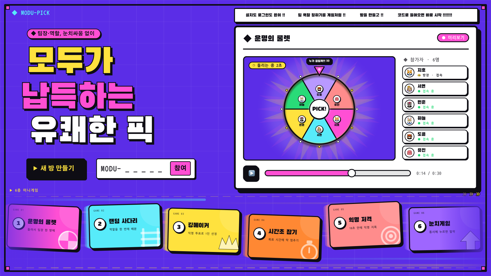
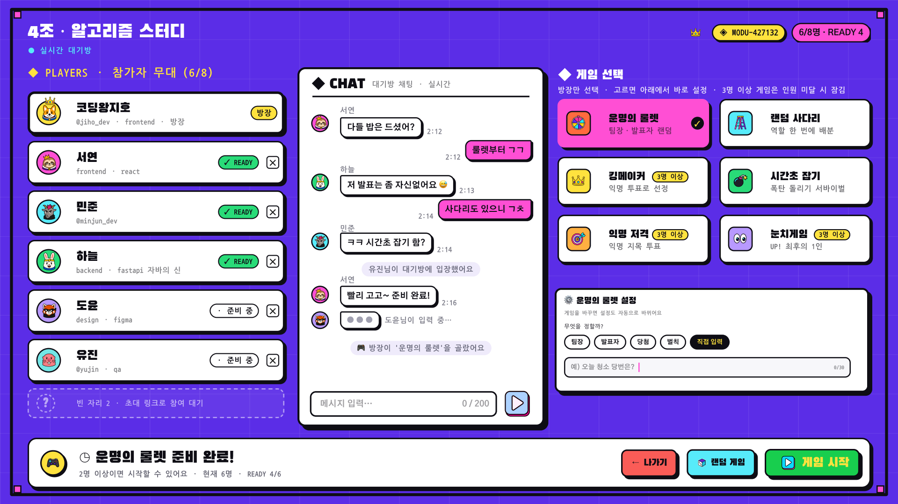
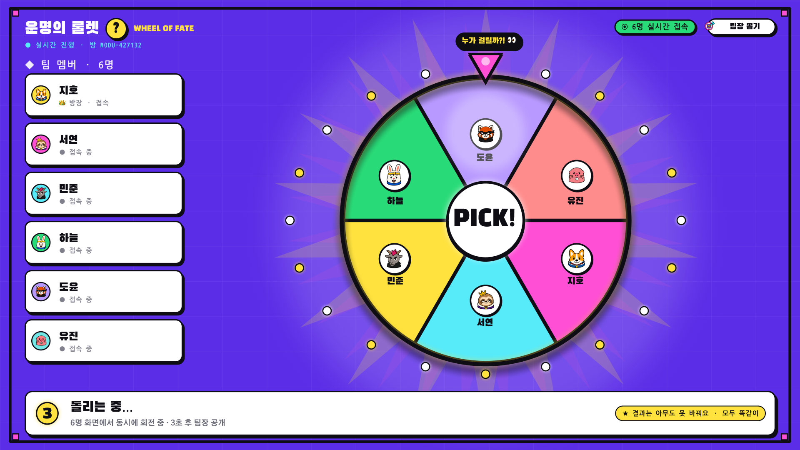
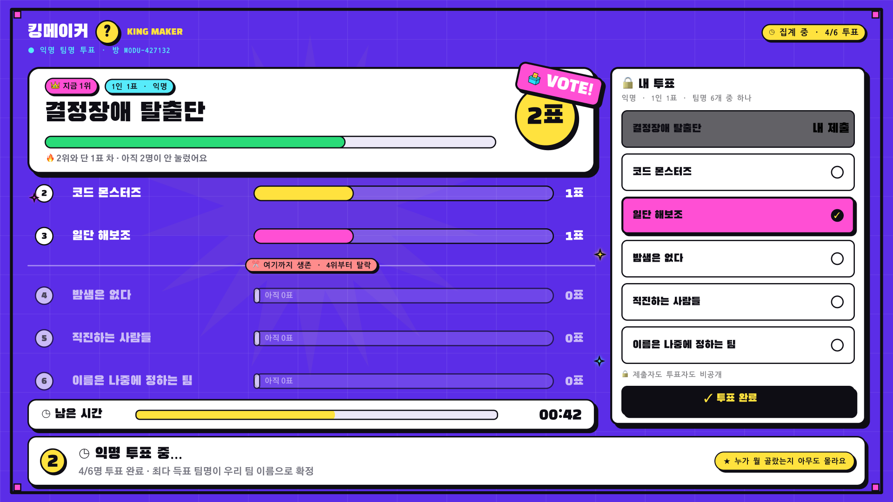
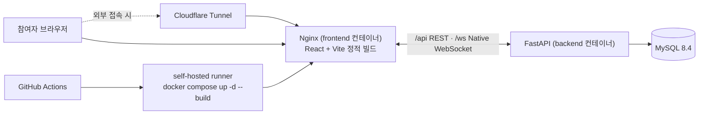

<div align="center">

  

  <h1>MODU-PICK</h1>

  <p><strong>모두가 납득하는 유쾌한 선택</strong></p>
  <p>
    팀장·역할·팀명을 정할 때 생기는 눈치 싸움과 감정 소모를<br />
    실시간 미니게임으로 바꾸는 게임형 의사결정 플랫폼입니다.
  </p>

  <p>
    
    
    
    
    
    
    
    
  </p>

  <p>
    <a href="https://app.notion.com/p/7-28-e6fde0c692b883b18f3d019ed917e9b8?source=copy_link">Project Notion</a>
    ·
    <a href="https://www.figma.com/design/IIqIz0uigrSQJnyTDKDsg6/%EB%AA%B0%EC%9E%85-%EB%94%94%EC%9E%90%EC%9D%B8?node-id=0-1">Figma Design</a>
    ·
    <a href="https://github.com/SunMoonUniv">GitHub Organization</a>
  </p>

</div>

---

## MODU-PICK은 어떤 서비스인가요?

조별 과제, 스터디, 해커톤, 사내 TF처럼 처음 만난 팀에서는 팀장·역할·팀명처럼 사소하지만 꼭 필요한 결정을 내리는 데 생각보다 많은 시간이 듭니다.

MODU-PICK은 이 과정을 **설치와 로그인 없이 바로 참여할 수 있는 실시간 미니게임**으로 바꿉니다. 방을 만들고 초대 코드를 공유하면 팀원들이 동시에 접속해 채팅하고, 준비 상태를 맞춘 뒤, 모두가 같은 결과를 보는 게임으로 결정을 끝낼 수 있습니다.

> **핵심 가치:** 빠른 아이스브레이킹 · 공정한 결과 · 무지연 실시간 동기화

## 핵심 기능

- **로그인 없는 빠른 시작** — 방 생성 또는 6자리 초대 코드 입력만으로 참여합니다.
- **개성 있는 프로필** — 닉네임, 아바타 30종 중 하나, 한 줄 소개를 설정합니다. 아바타는 방 안에서 중복되지 않습니다.
- **실시간 대기방** — 입장·퇴장, Ready 상태, 채팅, 타이핑 상태를 모든 참여자에게 동기화합니다.
- **방장 중심의 게임 설정** — 방장이 게임과 옵션을 고르고, 팀원은 변경 내용을 실시간으로 확인합니다.
- **6종 의사결정 게임** — 무작위 추첨, 역할 배분, 익명 투표, 순발력 게임을 상황에 맞게 선택합니다.
- **서버가 확정하는 공정한 결과** — 무작위 결과와 시간 판정을 서버 기준으로 처리해 모든 화면에 같은 결과를 보여줍니다.
- **게임 이후에도 이어지는 흐름** — 결과 확인 후 다시 하기 또는 대기방 복귀를 선택할 수 있습니다.

## 주요 화면

<table>
  <tr>
    <td width="50%">
      
    </td>
    <td width="50%">
      
    </td>
  </tr>
  <tr>
    <td align="center"><strong>실시간 대기방</strong><br />참여자, 채팅, Ready 상태, 게임 설정을 한 화면에서 관리합니다.</td>
    <td align="center"><strong>운명의 룰렛</strong><br />모든 참여자의 화면에서 동일한 룰렛과 결과를 보여줍니다.</td>
  </tr>
</table>

<p align="center">
  
</p>
<p align="center">
  <strong>킹메이커</strong><br />
  아이디어를 익명으로 제출하고 투표해 팀명·프로젝트명·메뉴 등을 결정합니다.
</p>

## 6개의 미니게임

| Game | 이름 | ID | 최소 인원 | 결정하는 방법 | 활용 예시 |
| :---: | --- | --- | :---: | --- | --- |
| 01 | **운명의 룰렛** | `roulette` | 2 | 참여자 중 한 명을 공정하게 무작위 추첨 | 팀장, 발표자, 벌칙 정하기 |
| 02 | **랜덤 사다리** | `ladder` | 2 | 참여자와 여러 역할을 한 번에 연결 | PPT, 자료 조사, 발표 역할 분담 |
| 03 | **킹메이커** | `kingmaker` | 3 | 익명 의견 제출 후 투표로 최종 선택 | 팀명, 프로젝트명, 메뉴 정하기 |
| 04 | **시간초 잡기** | `timer` | 2 | 목표 시간에 가장 가깝게 타이머 정지 | 순서, 당첨자, 벌칙 대상 정하기 |
| 05 | **익명 저격** | `snipe` | 3 | 질문에 맞는 참여자를 제한 시간 안에 익명 지목 | 숨은 능력자 찾기, 아이스브레이킹 |
| 06 | **눈치게임** | `nunchi` | 3 | 순서가 겹치지 않게 버튼을 누르고 마지막까지 생존 | 순발력 기반 역할·순서 정하기 |

방 정원은 2~10명이며, 인원이 모자란 게임은 대기방에서 선택 자체가 막힙니다.

## 사용자 흐름

1. 방장이 방을 만들고 초대 코드를 공유합니다.
2. 팀원은 코드를 입력하고 닉네임과 캐릭터를 설정합니다.
3. 모두 대기방에 들어와 채팅하고 `준비 완료`를 누릅니다.
4. 방장이 게임과 옵션을 설정한 뒤 게임을 시작합니다.
5. 모든 참여자가 동기화된 게임 화면에서 함께 플레이합니다.
6. 결과를 확인한 뒤 다시 하거나 대기방으로 돌아갑니다.

## 아키텍처



브라우저가 보는 오리진은 nginx 하나뿐입니다. `/api`와 `/ws`를 백엔드로 넘기므로 배포에서는 CORS가 발생하지 않고, 외부 공개는 공유기 포트를 열지 않고 Cloudflare 터널로 처리합니다.

Ready·온라인 여부·현재 소켓·진행 중인 판처럼 수명이 짧은 상태는 백엔드 프로세스 메모리(`app/infra/memory`)에 두고, 방·참여자·게임 회차·투표·최종 결과만 MySQL에 저장합니다. 서버를 재기동하면 남은 방을 모두 정리하므로(`main.py` lifespan) 보존해야 할 데이터가 구조적으로 없습니다. 여러 인스턴스로 확장할 때는 이 메모리 상태를 공유 저장소로 옮기는 작업이 선행되어야 합니다.

## 기술 스택

| 영역 | 기술 | 선택 이유 |
| --- | --- | --- |
| Frontend | React 19, Vite 7, TypeScript, Zustand, React Router | 실시간 SPA를 빠르게 개발하고 사용자 상태 변화에 즉시 반응 |
| Backend | Python 3.14, FastAPI, uvicorn | 비동기 API와 WebSocket 로직을 한 흐름으로 구현 |
| Realtime | Native WebSocket | 의존성을 줄이고 이벤트 프로토콜을 명확하게 관리 |
| Database | MySQL 8.4, SQLAlchemy(Core), aiomysql | 관계·제약조건 중심의 데이터 설계 |
| Migration | 순수 SQL 스크립트 (`db_migration/sql`) | 스키마 정본을 사람이 읽는 DDL 한 벌로 유지 (ADR-28) |
| Local Infra | Docker, Docker Compose | 팀원이 같은 환경을 빠르게 구성 |
| Deployment | Nginx, Cloudflare Tunnel | 단일 오리진 서빙과 포트 개방 없는 외부 공개 |
| CI/CD | GitHub Actions (self-hosted runner) | 테스트·빌드·배포 자동화 |
| 테스트 | pytest (계약 테스트는 실제 MySQL에 접속), oxlint, flake8 | 제약조건과 이벤트 계약을 실제 환경에서 검증 |

## 시작하기

`.env`를 만들고 컨테이너 세 개를 띄우면 끝납니다.

```bash
cp .env.example .env          # 비밀번호 등 설정. .env는 저장소에 올라가지 않습니다
docker compose up -d          # database + backend + frontend
```

- 화면: <http://localhost:8080>
- API 문서: <http://localhost:8000/docs>
- 상태·로그: `docker compose ps`, `docker compose logs -f backend`
- 정지: `docker compose down` (데이터 유지) / `docker compose down -v` (스키마 초기화)

외부 공개가 필요하면 `.env`에 `CF_TUNNEL_TOKEN`을 채우고 터널 프로필을 함께 띄웁니다.

```bash
docker compose --profile tunnel up -d
```

### 프론트엔드 개발 모드

```bash
docker compose up -d database backend   # 백엔드는 컨테이너로
cd frontend && npm install && npm run dev   # http://localhost:5173
```

vite 프록시가 `/api`·`/ws`를 백엔드로 넘깁니다. 코드를 바꿨을 때는 `docker compose up -d --build backend`(또는 `frontend`)로 다시 빌드합니다.

### 테스트

```bash
docker compose up -d database           # 계약 테스트는 실제 MySQL 8.4에 붙습니다
docker compose stop backend             # 같은 DB를 두고 경합하지 않게 멈춥니다
cd backend && pip install -r requirements-dev.txt && pytest

cd frontend && npm run build && npm run lint   # 타입체크 + 프로덕션 빌드, oxlint
```

## 저장소 구조

```
backend/           FastAPI 애플리케이션
  app/api          REST 엔드포인트 (rooms, games)
  app/ws           WebSocket 라우터·연결 관리·이벤트 봉투
  app/domain       순수 규칙 — 상태 머신, 게임 6종 판정, RNG
  app/services     방·참여자·대기방·회차·게임 진행 서비스
  app/infra        DB 세션과 테이블, 메모리 런타임 상태, 레이트 리밋
  tests            contract(실제 MySQL) · domain · services
frontend/          React + Vite SPA, nginx 설정, Dockerfile
db_migration/sql/  스키마 정본 DDL과 권한 스크립트 (컨테이너 첫 기동에 자동 적용)
docs/              설계 정본 11개 폴더
.github/workflows/ 백엔드·프론트 CI와 develop 배포 파이프라인
```

`docs_legacy/`, `frontend_legacy/`, `mvp/`는 초기 프로토타입 기록이며 현재 실행 경로에 포함되지 않습니다.

## 개발 원칙

- 모든 게임 결과와 시간 판정은 **서버를 단일 기준**으로 삼습니다.
- 같은 입력이 재전송되어도 한 번만 반영되도록 멱등성을 보장합니다.
- 익명 게임에서는 투표자 정보를 일반 응답과 화면에 노출하지 않습니다.
- 실시간 애니메이션 프레임은 저장하지 않고, 복구에 필요한 회차와 최종 결과만 저장합니다.
- 방장이 이탈하거나 방이 만료되면 참여자에게 상태를 알리고 관련 데이터를 안전하게 정리합니다.
- **재접속 경로를 두지 않습니다.** 새로고침은 곧 퇴장이며, 소켓이 끊기면 30초(방장 60초) 유예 뒤 확정됩니다. 판정·명단·익명성 설계가 이 전제 위에 서 있습니다.
- 방 조회는 IP 단위 분당 20회로 제한합니다. 6자리 코드 공간을 전수 탐색으로 캐내지 못하게 하려는 것입니다.

## 알아둘 동작

- 새로고침하면 방에서 빠집니다. 게임이 시작된 방에는 새 소켓이 들어갈 수 없습니다.
- 방장이 나가면 방이 사라집니다. 방장 위임이 없습니다.
- 무활동 방은 만료되고, 스위퍼가 60초 주기로 정리합니다.
- 서버를 재기동하면 모든 방이 사라집니다. 채팅 이력도 서버에 저장하지 않습니다.

## 프로젝트 진행 현황

> 2026-08-12 기준

- [x] 프로젝트 기획 및 6종 미니게임 규칙 정의
- [x] 사용자 흐름, 와이어프레임, 화면 설계
- [x] 기술 스택 선정
- [x] REST API · WebSocket 명세 확정 ([`docs/07_api`](./docs/07_api/README.md))
- [x] 데이터 모델링 및 스키마 스크립트 (`db_migration/sql`, 업무 테이블 6종)
- [x] 백엔드 구현 — 방·대기방·회차 서비스와 미니게임 6종 서버 판정
- [x] 프론트엔드 구현 — 홈·프로필·대기방·게임 6종·결과 화면
- [x] CI/CD 및 배포 환경 — 백엔드·프론트 CI, docker compose 배포, Cloudflare 터널
- [ ] QA/QC · 통합 테스트 — 계약·도메인 테스트 진행 중, 부하·장애 시나리오 미완

## 협업 영역

| 영역                   | 담당자                                                                                                | 주요 책임                                         |
|------------------------|-------------------------------------------------------------------------------------------------------|---------------------------------------------------|
| PM · QA · Test         | [이도현](https://github.com/bbabbico)                                                                 | 요구사항 관리, 일정 조율, 품질 기준 및 테스트     |
| Design                 | [원세찬](https://github.com/sechan12912),[이연주](https://github.com/iee129)                          | 사용자 흐름, 화면 설계, 디자인 시스템 및 인터랙션 |
| Frontend               | [문석용](https://github.com/Marble2468)                                                               | 대기방·게임 UI, 실시간 상태 반영, 클라이언트 연출 |
| API · WebSocket        | [이연주](https://github.com/iee129)                                                                   | REST API, 실시간 이벤트 계약, 인증·권한           |
| Backend Logic          | [원세찬](https://github.com/sechan12912)                                                              | 방·참여자·게임 상태 머신과 서버 판정              |
| Database               | [김효성](https://github.com/hyokim1025)                                                               | 데이터 모델, 제약조건, 트랜잭션, 마이그레이션     |
| Docker · Github action | [서현석](https://github.com/orgs/SunMoonUniv/people/hyeonseok0716)                                    | 개발 환경, 배포, 라우팅, 운영 자동화              |

## 문서

설계 정본은 [`docs/`](./docs/README.md)에 목적별 11개 폴더로 정리되어 있습니다.

| 폴더 | 내용 |
| --- | --- |
| [01_overview](./docs/01_overview/README.md) | 제품 정의, 목표와 범위, 역할, 도메인 지도, 우선순위 |
| [02_features](./docs/02_features/README.md) | 도메인별 기능 명세와 권한 매트릭스 |
| [03_requirements](./docs/03_requirements/README.md) | 요구사항 정본, 전역 규칙, 비기능 요구사항, 인수 기준 |
| [04_architecture](./docs/04_architecture/README.md) | 시스템 구조, WebSocket, 판정 엔진, 방 상태 머신, 배포 |
| [05_game_rules](./docs/05_game_rules/README.md) | 게임 공통 기준과 미니게임 6종 상세 규칙 |
| [06_database](./docs/06_database/README.md) | ERD, 테이블 명세, 제약조건, 트랜잭션, 마이그레이션 |
| [07_api](./docs/07_api/README.md) | API 규약, REST, WebSocket 이벤트, 에러 매핑 |
| [08_screen](./docs/08_screen/README.md) | 화면 표준, 디자인 토큰, 화면 명세와 추적성 |
| [09_tech_stack](./docs/09_tech_stack/README.md) | 기술 스택과 선정 사유 |
| [10_glossary](./docs/10_glossary/README.md) | 도메인 용어, 에러 코드, enum과 상태 머신, ID 규약 |
| [11_fairness](./docs/11_fairness/README.md) | 서버 판정 권위, 익명성, 치팅 방지, 개인정보 수명, 위협 모델 |

외부 링크

- [프로젝트 허브 · Notion](https://app.notion.com/p/7-28-e6fde0c692b883b18f3d019ed917e9b8?source=copy_link)
- [UI/UX 디자인 · Figma](https://www.figma.com/design/IIqIz0uigrSQJnyTDKDsg6/%EB%AA%B0%EC%9E%85-%EB%94%94%EC%9E%90%EC%9D%B8?node-id=0-1)
- [프로젝트 조직 · GitHub](https://github.com/SunMoonUniv)

---

<p align="center">
  <strong>어색한 침묵 대신, 모두가 웃으며 납득하는 선택.</strong><br />
  MODU-PICK
</p>
