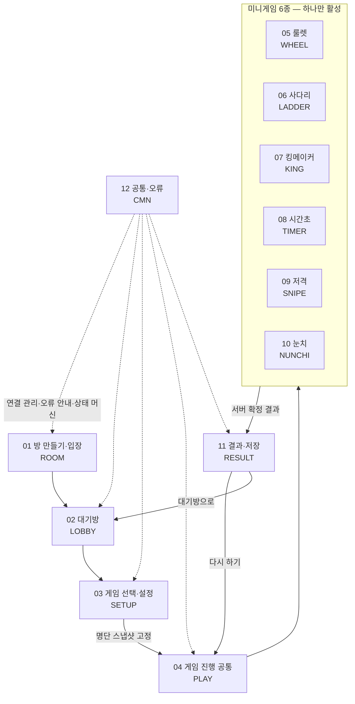

# 도메인 지도

> **대상**: 전 개발·신규 합류자
> **작성일**: 2026-08-02
> **원천**: [../README.md](../README.md)(고정 기준 — 도메인 12개 · 기능 접두사 12종) · [../10_glossary/04_id_conventions.md](../10_glossary/04_id_conventions.md)(접두사 ↔ 도메인 ↔ gameId 매핑 정본) · docs_legacy/requirements.md §4(US 번호대) · docs_legacy/features.md §2~8(F 번호대)

ModuPick을 12개 문서 도메인으로 나누고 각 도메인의 기능 접두사·문서 소유권·의존 관계를 정리한다. **도메인 경계가 곧 문서 소유권 경계**이며 기능 ID 채번은 각 도메인 파일에서만 한다. 본 문서는 지도이지 채번처가 아니다 — 접두사와 gameId의 매핑 정본은 [../10_glossary/04_id_conventions.md](../10_glossary/04_id_conventions.md)이고 기능 수의 정본은 [../02_features/README.md](../02_features/README.md)다.

## 12개 도메인

| # | 도메인 | 접두사 | 담는 것 | 기능 명세 소유 |
|:-:|--------|--------|---------|----------------|
| 01 | 방 만들기·입장 | ROOM | 방 생성 · 코드 발급 · 코드·링크 입장 · 입장 검증 · 프로필 확정 · 초대 공유 | [../02_features](../02_features/README.md) |
| 02 | 대기방 | LOBBY | 참가자 목록 동기화 · 채팅 · 준비 완료 · 내보내기 · 방장 이탈 폐기 · 방 정리 | [../02_features](../02_features/README.md) |
| 03 | 게임 선택·설정 | SETUP | 게임 카탈로그 · 인원 게이트 · 랜덤 선택 · 주제 · 게임별 설정 · 게임 시작 · 3초 가이드 | [../02_features](../02_features/README.md) |
| 04 | 게임 진행 공통 | PLAY | 판정 엔진 · 도착 시각 기록 · 멱등 처리 · 진행 상황 동기화 · 제한 시간 · 미입력 자동 처리 · 결과 브로드캐스트 | [../02_features](../02_features/README.md) |
| 05 | 운명의 룰렛 | WHEEL | 조각 배치 · 당첨자 추첨 · 회전 연출 | [../02_features](../02_features/README.md) |
| 06 | 사다리타기 | LADDER | 사다리 구조 생성 · 경로 계산 · 항목 자동 맞춤 · 동시 경로 연출 | [../02_features](../02_features/README.md) |
| 07 | 킹메이커 | KING | 안건 제출 · 셔플 공개 · 투표 · 개표 · 결선 · 안건 0/1개 예외 · 실명 공개 | [../02_features](../02_features/README.md) |
| 08 | 시간초 잡기 | TIMER | 개별 타이머 · 블라인드 · STOP 확정 · 오차 계산 · 마감 처리 · 동점자 재대결 | [../02_features](../02_features/README.md) |
| 09 | 익명 저격 | SNIPE | 후보 목록 · 지목 제출 · 피격 집계 · 결선 재투표 · 유효표 0 처리 · 지목선 연출 | [../02_features](../02_features/README.md) |
| 10 | 눈치게임 | NUNCHI | 라운드 진행 · UP 입력 · 판정창 그룹핑 · 안전 확정·잔류 판정 · 최후 1인 · 무효 라운드 · 라운드 기록 | [../02_features](../02_features/README.md) |
| 11 | 결과·저장 | RESULT | 결과 전환 · 결과 화면 4형태 · 이미지 저장 · 공유 · 다시 하기 · 대기방 복귀 · 결과 보관 | [../02_features](../02_features/README.md) |
| 12 | 공통·오류 | CMN | WebSocket 연결 관리 · 모바일 대응 · 오류 안내 · 방 상태 머신 | [../02_features](../02_features/README.md) |

- **게임 6종은 각각 독립 도메인**이다. 판정 규칙이 게임마다 다르고 상태머신도 공유하지 않아 한 문서에 묶으면 어느 규칙이 어느 게임 것인지 흐려진다.
- 도메인 04(게임 진행 공통)는 게임 6종이 **공유하는 토대**다. 여섯 도메인 어디서든 같은 규칙을 되풀이하지 않고 04를 가리킨다.
- 접두사별 기능 수와 총수는 [../02_features/README.md](../02_features/README.md)가 확정하며 본 문서는 개수를 자체 인용하지 않는다.

## 접두사 대응

문서 도메인 · 기능 접두사 · 코드의 gameId가 세 층위로 갈린다. 표기가 다르므로 층을 섞어 쓰지 않는다.

| 도메인 | 문서 접두사(대문자) | 코드 gameId(소문자) | 화면 코드 |
|--------|--------------------|--------------------|-----------|
| 방 만들기·입장 | ROOM | — | ROOM-* |
| 대기방 | LOBBY | — | LOBBY-* |
| 게임 선택·설정 | SETUP | — | SETUP-* |
| 게임 진행 공통 | PLAY | — | — (게임별 화면에 흡수) |
| 운명의 룰렛 | WHEEL | roulette | WHEEL-PLAY |
| 사다리타기 | LADDER | ladder | LADDER-PLAY |
| 킹메이커 | KING | kingmaker | KING-PLAY |
| 시간초 잡기 | TIMER | timecatch | TIMER-PLAY |
| 익명 저격 | SNIPE | sniper | SNIPE-PLAY |
| 눈치게임 | NUNCHI | nunchi | NUNCHI-PLAY |
| 결과·저장 | RESULT | — | RESULT-* |
| 공통·오류 | CMN | — | 전 화면 공통 |

- **문서 접두사와 gameId는 이름이 다르다** — 문서는 WHEEL, 코드는 roulette를 쓴다. 위 표가 아니라 [../10_glossary/04_id_conventions.md](../10_glossary/04_id_conventions.md)가 이 매핑의 유일한 정본이며 본 표는 그 값을 싣는다.
- **화면 코드 열은 형식 예시**이며 채번이 아니다. 게임 화면은 {게임접두사}-PLAY 형태이고 별표는 그 도메인의 화면들을 가리킨다. 실제 코드 집합의 채번 정본은 [../08_screen/README.md](../08_screen/README.md)다.
- 에러 코드 네임스페이스는 접두사를 소문자화한 것이 **아니다.** 에러는 발생 주체로 묶어 room · member · game · vote · common 5종을 쓰며 전수 정본은 [../10_glossary/02_error_codes.md](../10_glossary/02_error_codes.md)다.
- 요구사항은 같은 12접두사에 횡단 2종(REQ-GLB · REQ-NFR)을 더해 쓴다.

## 도메인 간 흐름

한 판이 도는 동안 도메인이 넘어가는 순서다.

## 흐름의 규칙

| 전이 | 조건 | 근거 |
|------|------|------|
| ROOM → LOBBY | 방 생성 또는 입장 검증 통과. 진행 중인 방은 거절한다 | D-16 |
| LOBBY → SETUP | 방장이 게임을 고른다. 인원 미달 게임은 후보에서 빠진다 | D-21 |
| SETUP → PLAY | 방장 제외 전원 준비 완료 + 방장의 시작. **명단 스냅샷이 여기서 고정된다** | D-13 · D-15 |
| PLAY → 게임 6종 | 선택된 게임 하나만 활성이다. 게임을 섞어 돌리지 않는다 | — |
| 게임 → RESULT | 서버가 결과를 확정하고 연출이 끝난 뒤 3초 후 전원 동시 전환 | D-05 · D-41 |
| RESULT → PLAY | 방장의 다시 하기. 같은 게임·같은 설정이며 가이드를 띄우지 않는다 | D-25 · D-43 |
| RESULT → LOBBY | 방장의 대기방 복귀. 지난 판의 결과는 다시 열리지 않는다 | D-44 |
| 어느 단계 → 표지 | 방장 이탈·마지막 참가자 이탈·10분 무활동. 방이 삭제된다 | D-11 · D-12 |

- **되돌아가는 경로는 RESULT에서 둘뿐**이며 게임 도중 대기방으로 돌아가는 경로는 무효 라운드(D-39)와 킹메이커 안건 0개 예외 두 곳에만 있다.
- CMN은 전이가 아니라 **횡단 관심사**다. 연결 관리·오류 안내·방 상태 머신이 전 도메인에 걸린다.

## 도메인과 다른 폴더의 대응

같은 도메인을 여러 폴더가 다른 축으로 기술한다. 어느 폴더가 무엇의 정본인지를 아래로 고정한다.

| 축 | 폴더 | 도메인과의 관계 |
|----|------|-----------------|
| 무엇을 만드나 | [../02_features](../02_features/README.md) | 도메인 12개 × 기능 ID. **F-ID 채번 정본** |
| 사용자가 무엇을 하나 | [../03_requirements](../03_requirements/README.md) | 도메인 12접두사 + 횡단 2종. **REQ 채번 정본** |
| 어떻게 판정하나 | [../05_game_rules](../05_game_rules/README.md) | 게임 도메인 6개(05~10)에만 대응. 상태머신·종료 증명을 담는다 |
| 어떤 화면인가 | [../08_screen](../08_screen/README.md) | 도메인 → 화면 코드. **화면 코드 채번 정본** |
| 어떤 데이터인가 | [../06_database](../06_database/README.md) | 도메인 경계와 테이블 경계가 1:1이 아니다 — 테이블 6개가 12도메인을 가로지른다 |
| 어떤 인터페이스인가 | [../07_api](../07_api/README.md) | REST는 도메인 01·02 중심, WebSocket 이벤트는 02~11 전역이다 |
| 왜 그렇게 정했나 | [06_design_decisions.md](./06_design_decisions.md) | 도메인을 가로지른다. 결정 하나가 여러 도메인을 구속한다 |

**도메인 경계와 테이블 경계는 일치하지 않는다.** 테이블은 6개이고 도메인은 12개다 — 게임 6종이 game_rounds · game_options · votes · game_results를 공유한다. 도메인 축으로 테이블을 나누려 하지 않는다.

## 관련 문서

- [01_product_summary.md](./01_product_summary.md) — 제품 정의·게임 6종
- [02_goals_scope.md](./02_goals_scope.md) — 도메인별 범위·범위 밖
- [05_priorities_roadmap.md](./05_priorities_roadmap.md) — 도메인별 구현 현황
- [06_design_decisions.md](./06_design_decisions.md) — 흐름 규칙의 근거 D-NN
- [../10_glossary/04_id_conventions.md](../10_glossary/04_id_conventions.md) — 접두사·gameId 매핑 정본
- [../02_features/README.md](../02_features/README.md) — 기능 채번 정본
- [../04_architecture/README.md](../04_architecture/README.md) — 방 상태머신·판정 엔진
