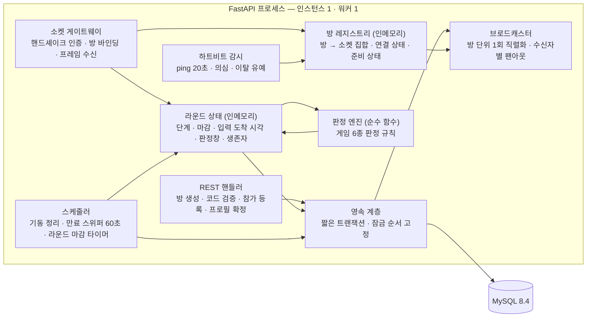

# 01 시스템 아키텍처

> **대상**: ModuPick 전체 구성 · 컴포넌트 책임 · 요청 흐름과 이벤트 흐름 · 프론트/백엔드 경계 · 범위 경계
> **작성일**: 2026-08-02
> **원천**: git ecceb11 docs/03_architecture/00_tech_stack.md · 01_data_model.md · git 529e312 docs/api.md(REST·소켓 표면) · docs/db.md §10~12 · §19~20 · backend/app/main.py · backend/app/config.py · frontend/src/lib/store.ts · docs_legacy/techstack.md · [../README.md](../README.md)(고정 기준·전역 불변식)

ModuPick은 **React 19 + Vite** SPA 하나와 **FastAPI** 프로세스 하나, **MySQL 8.4** 하나로 이뤄진다. 화면은 Vercel에서, 서버와 DB는 AWS EC2 한 대에서 돈다. 사용자는 링크를 열고 닉네임만 정하면 방에 들어오며 로그인·설치·개인정보 수집이 없다.

계층 구분의 기준은 **결과를 누가 정하는가**다. 서버는 판정하고 클라이언트는 표현한다. 화면이 빠른 기기, 회선이 빠른 사람이 유리해질 여지를 구조에서 없애기 위해 게임의 모든 판정 입력은 서버 도착 시각으로 다시 계산되고, 클라이언트가 보낸 시각·순서·결과는 판정에 쓰이지 않는다.

## 컴포넌트 구성

| 계층 | 구성 요소 | 근거 |
|------|-----------|------|
| 클라이언트 | React 19 + Vite + TypeScript SPA · zustand 상태 스토어 · WebSocket 클라이언트 · 로컬 스토리지(채팅) | frontend/src/lib/store.ts · git ecceb11 docs/03_architecture/00_tech_stack.md |
| 정적 호스팅 | Vercel — SPA 번들 배포와 HTTPS 종단. 서버 로직을 두지 않는다 | ADR-22 |
| 엣지 | Nginx — TLS 종단 · WebSocket 업그레이드 중계 · 읽기 타임아웃 75초 · 페이로드 상한 | ADR-23 |
| 애플리케이션 | FastAPI 단일 프로세스(uvicorn · 워커 1). REST 표면 + WebSocket 표면 + 방 레지스트리 + 판정 엔진 + 스케줄러 | backend/app/main.py · ADR-01 · ADR-02 |
| 데이터 | MySQL 8.4 컨테이너 — **6테이블**(rooms · participants · game_rounds · game_options · votes · game_results) | git 529e312 docs/db.md · ADR-05 |

현재 backend/app에는 헬스 체크와 소켓 배선 확인용 에코 엔드포인트만 있다(backend/app/main.py). 방 단위 라우팅·판정·DB는 미착수이며 본 문서는 **설계**를 기술한다.

## 프로세스 내부 구성



- **판정 엔진은 DB와 소켓을 모르는 순수 함수다.** 시각·명단·설정·시드를 인자로 받고 판정 결과만 돌려준다([03_judgment_engine.md](./03_judgment_engine.md)).
- **브로드캐스트는 영속 계층의 커밋 이후에만 일어난다.** 롤백된 사실이 화면에 남지 않게 하기 위해서다(ADR-18).
- 방 레지스트리와 라운드 상태는 **프로세스 메모리 전용**이며 DB에 반영하지 않는다(ADR-04).

## 컴포넌트 책임

| 컴포넌트 | 책임 | 하지 않는 것 |
|----------|------|--------------|
| SPA | 화면 전환 · 입력 수집 · 연출 렌더 · 남은 시간 표시 · 채팅 로컬 보관 | 결과 계산 · 순서 판정 · 마감 선언 · 권한 판정 |
| Nginx | TLS 종단 · 업그레이드 헤더 중계 · 유휴·페이로드 상한 | 인증 · 라우팅 분기(경로 두 개만 나눈다) |
| REST 핸들러 | 방 생성 · 코드 검증 · 참가 등록 · 프로필 확정 · 토큰 발급 | 게임 진행 — 대기방 진입 이후는 전부 소켓이다 |
| 소켓 게이트웨이 | 핸드셰이크 인증과 방 바인딩 · 프레임 수신 시각 기록 · 이벤트 라우팅 | 게임 규칙 해석 |
| 방 레지스트리 | 방↔소켓 대응 · 연결 상태 3단계 · 준비 상태 · 방 상태 버전 | 영속 — 재기동 시 함께 사라진다 |
| 라운드 상태 | 단계·마감·입력 도착 시각·판정창 그룹·생존자 명단 보관 | 규칙 판정 자체 |
| 판정 엔진 | 게임 6종의 결정론적 판정 | DB 접근 · 소켓 접근 · 현재 시각 읽기 |
| 브로드캐스터 | 방 단위 직렬화 1회 · 수신자별 독립 전송 · 실패 소켓 격리 | 전송 성공 보장 · 재전송 큐 |
| 하트비트 감시 | ping 발신 · pong 감시 · 의심 전이 · 유예 만료 통지 | 이탈 확정의 부작용 실행(방 삭제는 방 수명 규칙이 한다) |
| 스케줄러 | 기동 시 고아 방 정리 · 만료 스위퍼 · 라운드 마감 타이머 | 판정 |
| 영속 계층 | 짧은 트랜잭션 · 잠금 순서 고정 · 멱등 제약 · 커밋 후 통지 | 진행 중 상태 저장 |
| MySQL | 방·참가자·라운드·선택지·투표·확정 결과 보관과 제약 강제 | 실시간 상태 · 판정 |

## 요청 흐름 — 방 만들기부터 대기방까지

방 진입 전은 REST, 진입 후는 소켓이다. 경계가 여기서 한 번 갈린다.

```
[방장]                        [SPA]              [REST]                 [MySQL]
 방 만들기 입력  ───────────▶ 방 생성 요청 ─────▶ 코드 생성·중복 회피
                                                 방·방장 참가자 저장 ──▶ commit
                             ◀── 방 코드 · 방장 토큰 ──
 프로필 확정  ─────────────▶ 프로필 확정 요청 ──▶ 닉네임·아바타 중복 검사
                                                 참가자 갱신 ─────────▶ commit
                             ◀── 확정 응답 ──
                             핸드셰이크(방 코드 + 토큰) ──▶ [소켓 게이트웨이]
                                                          토큰의 방 == 접속 방 검증
                                                          소켓에 참가자·방·방장 여부 바인딩
                             ◀── 방 스냅샷 1회 ──
                             이후 부분 갱신 이벤트만 수신
```

- **참가자는 참가 등록 응답을 받는 즉시 핸드셰이크한다.** 이때는 프로필이 없는 대기 상태이며 정원은 차지하지만 다른 사람 목록에는 아직 보이지 않는다.
- **다른 사람 화면에 나타나는 시점은 프로필 확정이다.** 확정 순간 입장 이벤트가 방에 브로드캐스트된다.
- 참가 등록 후 **15초** 안에 핸드셰이크가 없으면 서버가 슬롯을 푼다(git 529e312 docs/api.md 연결 수명주기 6항).
- 진입 표면과 응답 규격의 정본은 [../07_api/README.md](../07_api/README.md)다.

## 이벤트 흐름 — 게임 입력에서 결과까지

밀리초를 다투는 경로다. 이 경로 어디에도 DB 왕복이 없다.

```
[참가자 N명]        [소켓 게이트웨이]      [라운드 상태]        [판정 엔진]      [영속]      [브로드캐스터]
 입력 프레임 ─────▶ 수신 즉시 단조 시계로
                    도착 밀리초 기록
                    소켓 바인딩으로 주체 확정
                    ──────────────────▶ 멱등 검사
                                        (요청 식별자 · 라운드
                                         · 단계 · 반복 회차)
                                        도착 시각 배열에 추가
                                        판정창 그룹핑
   마감 타이머 만료 또는 전원 입력 ────▶ ────────────────▶ 결정론적 판정
                                                          결과 · 다음 단계 산출
                                        ◀───────────────
                                        확정 결과 ─────────────────▶ 라운드·결과 저장
                                                                     commit ─────▶ 방 단위 1회 직렬화
                                                                                   수신자별 독립 전송
 ◀────────────────────────────────────────────────────────────────────────────── 결과 이벤트(전원 동일)
```

- **입력이 도착할 때마다 전원에게 알리지 않는다.** 중간 집계를 아무에게도 보여주지 않는다는 불변식 때문이며, 브로드캐스트되는 것은 "누가 입력을 마쳤다"는 완료 표시뿐이다.
- 판정 시점은 **마감 타이머 만료** 또는 **전원 입력 완료** 중 먼저 오는 것이다. 미입력자는 게임별 기본값으로 자동 처리한다.
- 동점이면 다음 회차로 재진입하며 반복 상한은 3회다. 초과하면 방장 선택 대기로 넘어간다(ADR-19).
- 이벤트명·페이로드의 정본은 [../07_api/03_socket_events.md](../07_api/03_socket_events.md)다.

## 프론트/백엔드 경계

경계를 잘못 그으면 공정성이 무너진다. 아래가 그 선이다.

| 관심사 | 클라이언트 | 서버 |
|--------|-----------|------|
| 결과 | 서버가 확정한 결과로 수렴하는 연출을 그린다 | 결과를 확정한다 |
| 시각·순서 | 남은 시간을 표시한다 | 도착 시각을 찍고 순서를 정한다 |
| 마감 | 카운트다운이 0이 돼도 아무 일도 하지 않는다 | 마감을 선언하고 이후 입력을 버린다 |
| 난수 | 서버가 내려준 시드로 확정 결과의 연출만 재현한다 | 시드를 만들고 결과를 도출한다 |
| 권한 | 권한 없는 버튼을 감춘다(사용성) | 소켓 바인딩으로 다시 판정한다(통제) |
| 명단 | 서버가 준 명단을 그린다 | 게임 시작 시 명단을 스냅샷으로 고정한다 |
| 중복 입력 | 버튼을 잠근다(사용성) | 요청 식별자와 문맥 일치로 막는다(통제) |
| 채팅 | 브라우저에 보관한다 | 중계만 하고 저장하지 않는다 |
| 경과 시간(시간초 잡기) | **단조 시계로 측정해 보낸다(유일한 예외)** | 자신이 관측한 도착 시각 차이로 범위를 검증하고 벗어나면 거부한다 |

**클라이언트가 값을 만드는 자리는 시간초 잡기의 경과 시간 하나뿐이다.** 그 자리에도 서버 검증이 붙는다([04_time_and_timing.md](./04_time_and_timing.md)).

## 횡단 관심사

| 관심사 | 위치 | 정본 |
|--------|------|------|
| 연결 수명·하트비트 | 소켓 게이트웨이 · 하트비트 감시 | [02_realtime_websocket.md](./02_realtime_websocket.md) |
| 순서 보장 | 방 상태 버전 단조 증가 | [02_realtime_websocket.md](./02_realtime_websocket.md) |
| 멱등 | 라운드 상태의 처리 완료 집합 + DB UNIQUE | [03_judgment_engine.md](./03_judgment_engine.md) |
| 시각 | 저장 UTC · 판정 단조 시계 정수 밀리초 | [04_time_and_timing.md](./04_time_and_timing.md) |
| 방 수명 | 방 상태 머신 + 만료 스위퍼 | [05_room_state_machine.md](./05_room_state_machine.md) |
| 저장 경계 | 인메모리 전용 · MySQL · 클라이언트 | [06_memory_persistence_split.md](./06_memory_persistence_split.md) |
| 권한 | 소켓 바인딩 기반 서버 재검증 | [../02_features/08_permission_matrix.md](../02_features/08_permission_matrix.md) |
| 에러 표기 | 네임스페이스 + 스네이크 케이스 코드 | [../10_glossary/02_error_codes.md](../10_glossary/02_error_codes.md) |

## 범위 경계

구조를 설명하기 위한 부정형 서술이며 아래 항목은 만들지 않는다.

- **재접속·상태 복구 경로를 두지 않는다.** 끊긴 소켓을 되살리는 표면이 없다.
- **관전 모드·방 목록을 두지 않는다.** 방은 코드를 아는 사람만 들어온다.
- **로그인·회원가입·계정을 두지 않는다.** 토큰은 방 수명 동안만 유효하다.
- **서버가 채팅을 저장하지 않는다.** 중계만 하고 각자 브라우저에 남는다.
- **수평 확장·무중단 배포를 하지 않는다.** 공유 상태 저장소를 도입하지 않는다.
- **클라이언트 렌더링 성능을 판정 요소로 삼지 않는다.** 연출 길이는 결과에 영향을 주지 않는다.

## 관련 문서

- 폴더 인덱스 → [README.md](./README.md)
- 실시간 계층 → [02_realtime_websocket.md](./02_realtime_websocket.md)
- 판정 엔진 → [03_judgment_engine.md](./03_judgment_engine.md)
- 방 상태 머신 → [05_room_state_machine.md](./05_room_state_machine.md)
- 저장 경계 → [06_memory_persistence_split.md](./06_memory_persistence_split.md)
- 배포 구성 → [07_deployment_topology.md](./07_deployment_topology.md)
- 기술 결정 → [08_decision_records.md](./08_decision_records.md)
- 기술 스택 선정 사유 → [../09_tech_stack/README.md](../09_tech_stack/README.md)
