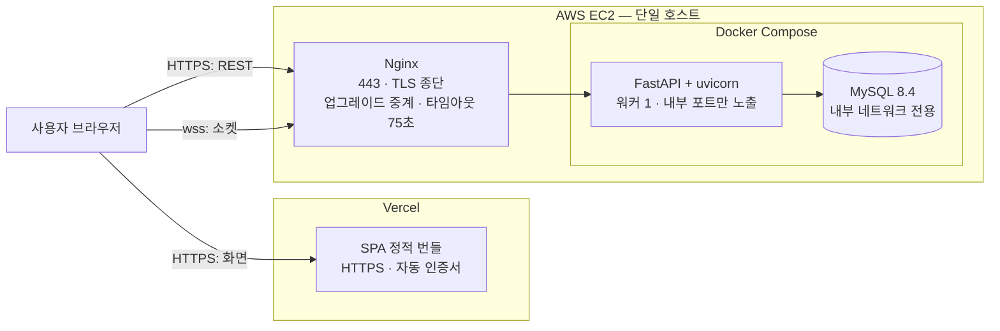

# 07 배포 구성

> **대상**: Vercel·EC2·MySQL 배치 · Nginx WebSocket 프록시 · 도메인과 TLS · 배포 절차와 다운타임 · 롤백 · 비기능 목표 판정 · 부하 특성 추정 · 모니터링
> **작성일**: 2026-08-02
> **원천**: git 529e312 docs/db.md §19(런타임·마이그레이션) · §20(연결·성능) · §21(보관·삭제·백업) · §22(배포·환경) · §23(모니터링) · git ecceb11 docs/09_deployment/00_overview.md · docs/03_architecture/00_tech_stack.md §5 · docs_legacy/requirements.md §5 NFR-01~10 · §8 Q-04 · backend/app/config.py · backend/app/main.py · [../README.md](../README.md)(고정 기준 — 배포 형상)

프론트엔드는 **Vercel**, 백엔드는 **AWS EC2** 한 대, DB는 같은 호스트의 **MySQL 8.4** 컨테이너다(ADR-22). 오케스트레이션을 두지 않고 Docker Compose로 운영하며(ADR-03), 백엔드는 **인스턴스 1개·워커 1개**로 고정한다(ADR-02).

배포 설계에서 가장 먼저 확인해야 할 것은 성능이 아니라 **연결이 성립하는가**다. Vercel이 HTTPS로 서비스되므로 브라우저는 평문 WebSocket 연결을 차단한다 — **백엔드는 wss가 필수**이고, 따라서 **도메인과 TLS 인증서가 첫 통합 배포의 선결 조건**이다. 그리고 Nginx 기본 설정으로는 WebSocket 핸드셰이크가 실패한다. 대기방 진입 이후 전 기능이 소켓이라 이 둘이 안 되면 아무것도 동작하지 않는다.

## 배치



| 구성 요소 | 위치 | 노출 | 비고 |
|-----------|------|------|------|
| SPA 번들 | Vercel | 공개 HTTPS | 서버 로직 없음. 백엔드 주소는 빌드 시 주입한다 |
| Nginx | EC2 | 443만 공개 | 80은 443으로 넘긴다. TLS 종단과 업그레이드 중계 담당 |
| FastAPI | EC2 컨테이너 | **호스트 내부만** | 외부에서 직접 접근할 수 없다 |
| MySQL 8.4 | EC2 컨테이너 | **Compose 내부 네트워크만** | 3306을 외부에 열지 않는다 |
| 데이터 볼륨 | EC2 디스크 | — | 컨테이너 교체와 무관하게 유지한다 |

**보안 그룹은 443과 관리 접속만 연다.** 애플리케이션 포트와 DB 포트를 외부에 열지 않는다. 애플리케이션은 최고 권한 DB 계정을 쓰지 않는다.

## 도메인과 TLS

| 항목 | 내용 |
|------|------|
| 프론트 도메인 | Vercel이 발급하는 도메인 또는 연결한 사용자 도메인. 인증서는 Vercel이 관리한다 |
| 백엔드 도메인 | **별도 도메인 또는 서브도메인이 필요하다.** IP 직접 접속으로는 인증서를 발급할 수 없어 wss를 쓸 수 없다 |
| 인증서 | 무료 인증 기관에서 발급하고 자동 갱신을 건다. 갱신 후 Nginx만 다시 읽으면 되므로 **방을 죽이지 않는다** |
| 오리진 허용 | 백엔드의 CORS 허용 목록과 소켓 오리진 검사에 프론트 도메인을 등록한다(backend/app/config.py의 cors_origins) |
| 프론트 설정 | SPA 번들에 백엔드 REST 주소와 소켓 주소를 빌드 환경변수로 주입한다. 로컬 개발은 평문, 배포는 보안 연결이다 |

**선결 조건 확인 순서** — ① 백엔드 도메인 확보 ② 인증서 발급 ③ Nginx 업그레이드 중계 확인 ④ 프론트에서 소켓 연결 성립 확인. ③까지 통과해도 ④에서 실패하는 경우가 오리진·혼합 콘텐츠 차단이다.

## Nginx WebSocket 프록시

```nginx
map $http_upgrade $connection_upgrade {
    default upgrade;
    ''      close;
}

server {
    listen 443 ssl;
    server_name <백엔드 도메인>;

    ssl_certificate     <인증서 체인 파일 경로>;
    ssl_certificate_key <인증서 키 파일 경로>;

    # WebSocket — 업그레이드 헤더를 넘기지 않으면 핸드셰이크가 실패한다
    location /ws/ {
        proxy_pass http://127.0.0.1:8000;
        proxy_http_version 1.1;
        proxy_set_header Upgrade    $http_upgrade;
        proxy_set_header Connection $connection_upgrade;
        proxy_set_header Host       $host;
        proxy_set_header X-Forwarded-For   $proxy_add_x_forwarded_for;
        proxy_set_header X-Forwarded-Proto $scheme;
        proxy_read_timeout 75s;      # 하트비트 20초 · pong 대기 60초보다 커야 한다
        proxy_send_timeout 75s;
        proxy_buffering off;         # 이벤트가 버퍼에 고이면 결과 동시성이 깨진다
    }

    # REST
    location /api/ {
        proxy_pass http://127.0.0.1:8000;
        proxy_set_header Host $host;
        proxy_set_header X-Forwarded-For   $proxy_add_x_forwarded_for;
        proxy_set_header X-Forwarded-Proto $scheme;
        client_max_body_size 64k;    # 방 생성·프로필·안건 텍스트면 충분하다
    }
}
```

| 함정 | 증상 | 대응 |
|------|------|------|
| 업그레이드 헤더 미중계 | 핸드셰이크가 400이나 502로 실패한다 | 위 설정의 두 헤더가 필수다 |
| 읽기 타임아웃이 짧음 | 연결이 주기적으로 끊긴다 | 75초로 둔다. 하트비트 주기·pong 대기보다 커야 한다 |
| 프록시 버퍼링 | 이벤트가 몰아서 도착해 결과 전환이 튄다 | 소켓 경로에서 버퍼링을 끈다 |
| 프로토콜 버전 기본값 | 업그레이드가 성립하지 않는다 | 소켓 경로에서 1.1을 명시한다 |
| 파일 디스크립터 상한 | 연결이 일정 수에서 더 늘지 않는다 | Nginx와 애플리케이션 양쪽의 상한을 올린다 |

## 환경 변수

| 이름 | 대상 | 내용 |
|------|------|------|
| DATABASE_URL | 백엔드 | MySQL 접속 문자열. 비동기 드라이버를 쓴다(backend/app/config.py 기본값 참조) |
| CORS_ORIGINS | 백엔드 | 허용 오리진 목록. 프론트 도메인을 쉼표로 나열한다 |
| MYSQL_DATABASE · MYSQL_USER · MYSQL_PASSWORD · MYSQL_ROOT_PASSWORD | DB 컨테이너 | 초기화 값 |
| 백엔드 REST 주소 · 소켓 주소 | 프론트 빌드 | Vercel 프로젝트 환경변수로 주입한다 |

**실제 비밀값을 저장소에 두지 않는다.** 예시 파일에는 형식만 적고 값은 배포 호스트에서 주입한다. 로컬·테스트·운영의 DB와 계정을 분리하고 운영 DB를 로컬 개발에 쓰지 않는다.

## 배포 절차와 다운타임

**백엔드 배포는 다운타임을 수용한다**(ADR-24). 인메모리 상태와 단일 인스턴스 때문에 무중단 배포가 원리적으로 불가능하다.

| 순서 | 단계 | 방에 미치는 영향 |
|:----:|------|------------------|
| 1 | 이미지 빌드·태그 부여·호스트 전송 | 없음 |
| 2 | 파괴적 변경이면 백업 선행 | 없음 |
| 3 | 마이그레이션 1회 실행(ADR-25) | 없음. 스키마 호환 변경만 이 시점에 적용한다 |
| 4 | 애플리케이션 컨테이너 중지 | **모든 소켓이 끊기고 진행 중 방이 사라진다** |
| 5 | 새 컨테이너 기동 | — |
| 6 | 기동 정리 — DB에 남은 방 전량 삭제(ADR-20) | 남아 있던 방 행이 정리되고 코드가 회수된다 |
| 7 | 준비 상태 확인 — DB 연결 + 리비전 일치 | — |
| 8 | 스모크 확인 — 헬스 응답 · 방 생성 · 소켓 핸드셰이크 · 스냅샷 수신 | — |

- **다운타임 추정은 컨테이너 교체 5~15초 + 기동 정리 1초 미만**이다. 실측 전이므로 추정으로 적는다.
- 방은 익명·일회성이라 사전 공지 대상이 없다. **배포 창을 사용이 적은 시각으로 잡는다.**
- **프론트엔드 배포는 방에 영향을 주지 않는다.** 정적 자원 교체이며 이미 열려 있는 소켓과 무관하다. 다만 이벤트 규격이 바뀌는 배포는 백엔드와 같은 창에서 한다.

## 롤백

| 상황 | 절차 |
|------|------|
| 애플리케이션 결함 | 이전 이미지 태그로 다시 기동한다. 기동 정리가 다시 돌아 방이 정리된다 |
| 스키마 호환 변경의 롤백 | 마이그레이션을 되돌리지 않는다. 이전 코드가 새 스키마에서 동작하도록 추가 → 양쪽 호환 → 이관 → 제거 순서로 나눠 배포한다 |
| 스키마 파괴 변경의 롤백 | 백업에서 복원한다. **복원은 데이터 손실을 동반하며 진행 중 방은 어차피 사라진 뒤다** |
| 프론트 롤백 | Vercel의 이전 배포로 되돌린다 |
| 인증서 갱신 실패 | Nginx 설정을 이전 인증서로 되돌리고 갱신을 다시 시도한다. 소켓 연결이 전부 실패하므로 즉시 확인 대상이다 |

**백업 검증은 파일 존재 확인으로 끝내지 않는다.** 별도 인스턴스에 복원해 테이블 수·행 수·참조 무결성을 확인한 시각을 기록한다.

## 비기능 목표 달성 판정

docs_legacy/requirements.md §5의 NFR-01~10 각각에 대해 **측정 방법**과 **주어진 아키텍처에서의 달성 가능성**을 판정한다. 요구사항 정본은 [../03_requirements/README.md](../03_requirements/README.md)이며 본 표는 아키텍처 관점의 판정이다.

| 원 ID | 항목 | 측정 방법 | 판정 |
|:-----:|------|-----------|------|
| NFR-01 | 실시간 반영 1초 | 브로드캐스트 발행 시각을 이벤트에 실어 보내고 클라이언트 수신 시각과의 차이를 기록한다. 방 10명 기준 상위 95퍼센트 값. **렌더 완료를 포함하지 않는다** | **달성 가능.** 단일 프로세스 팬아웃이라 서버 측 지연이 밀리초 단위이고 나머지는 왕복 지연이다 |
| NFR-02 | 결과 동시성 0.5초 | 같은 이벤트의 참가자별 수신 시각 최댓값 − 최솟값 | **달성 가능.** 방 단위 1회 직렬화 + 확인 응답 없는 팬아웃이라 편차가 전송 시간 차로 제한된다 |
| NFR-03 | 판정 정확도 ±10밀리초 | — | **달성 불가.** 지터가 그보다 크다. **재정의한다**(아래) |
| NFR-04 | 입력 멱등성 | 같은 요청 식별자를 100회 재전송해 반영 1건을 확인하는 계약 테스트. 지난 회차 입력 주입 테스트 | **달성 가능.** 요청 식별자 UNIQUE + 문맥 일치 2중 검사(ADR-17) |
| NFR-05 | 입력 신뢰 | 조작된 클라이언트 시각·순서·결과 필드를 주입해 판정이 바뀌지 않음을 확인한다 | **달성 가능.** 예외는 시간초 경과 시간 하나이며 서버 범위 검증으로 대체한다 |
| NFR-06 | 첫 화면 3초(3G) | 모바일 에뮬레이션 + 3G 스로틀링에서 표지 화면 최초 콘텐츠 표시 시각 | **조건부.** 번들 크기 상한과 초기 화면의 코드 분할을 두면 달성 가능하다고 본다. 연출 자원이 초기 번들에 섞이면 실패한다. **실측 필요** |
| NFR-07 | 동시 100방·1,000명 | 부하 시험(아래 절차) | **추정상 달성 가능.** 산술 추정 근거는 아래에 둔다. **실측 전에는 단정하지 않는다** |
| NFR-08 | 개인정보 | 스키마·응답 페이로드·로그 표본 점검 | **달성 가능.** 수집 항목이 닉네임·아바타·소개 태그뿐이다 |
| NFR-09 | 데이터 수명 | 방 삭제 후 하위 행 0건과 시드 조회 불가를 확인한다 | **달성 가능.** 방 삭제가 하위로 전파된다 |
| NFR-10 | 브라우저 | 최신 Chrome·Safari·Samsung Internet에서 수동 체크리스트 | **달성 가능.** 표준 WebSocket과 단조 시계 API만 쓴다 |

### NFR-03 재정의

| 축 | 원 요구 | 재정의 |
|----|---------|--------|
| 기록 | 정수 밀리초 | **유지한다** |
| 동시 판정 | 서버 도착 시각 ±10밀리초로 구분 | **판정창 그룹핑으로 대체한다.** 눈치게임은 방장 설정 300·500밀리초를 단위로 쓰고, 서버는 판정창보다 작은 차이를 순위 차로 쓰지 않는다 |
| 동률 | 정의 없음 | 도착 밀리초가 같으면 **수신 순번**으로 결정론적으로 정렬한다 |
| 시간초 잡기 | 언급 없음 | 경과 시간을 클라이언트 단조 시계가 재므로 지터가 실리지 않는다. **1밀리초 단위 비교가 유의미하며** 완전 동률은 재대결로 간다 |

**근거는 모바일 네트워크 지터가 50~100밀리초 수준이라는 점**이며, 이는 10밀리초보다 크다. 도착 시각 10밀리초 차이는 두 사람이 10밀리초 차이로 눌렀다는 뜻이 아니라 회선이 그만큼 달랐다는 뜻이다. 상세와 그룹핑 의사코드는 [04_time_and_timing.md](./04_time_and_timing.md), 결정 기록은 ADR-14다.

## 부하 특성 추정

**아래는 산술 추정이며 실측값이 아니다.** 실측 전에는 달성했다고 단정하지 않는다(ADR-26).

### 가정

| 항목 | 값 | 출처 |
|------|-----|------|
| 동시 방 | 100 | docs_legacy/requirements.md §5 NFR-07 |
| 방당 인원 | 10(최대 정원) | 고정 기준 |
| 동시 소켓 | **1,000** | 100 × 10 |
| 이벤트 페이로드 | 약 300바이트 | 상태 버전 포함 JSON 한 건의 어림값 |
| 방당 이벤트 발생률(최악) | 3건/초 | 게임 진행 중 입력 완료 표시·단계 전이·결과. 대기방은 이보다 훨씬 낮다 |
| 팬아웃 | 10 | 방 전체 전송 |
| 메시지 1건 전송 비용 | 20~50마이크로초 | Python 비동기 소켓 전송의 어림값 |
| 소켓당 메모리 | 40~60킬로바이트 | 프레임 버퍼·태스크·객체의 어림값 |

### 계산

| 항목 | 계산 | 결과 |
|------|------|------|
| 초당 메시지 | 100방 × 3건/초 × 팬아웃 10 | **3,000 메시지/초** |
| 아웃바운드 대역폭 | 3,000 × 300바이트 | 약 **0.9메가바이트/초 ≈ 7메가비트/초** |
| 직렬화 횟수 | 방 단위 1회 재사용 → 100방 × 3건/초 | **300회/초**(팬아웃과 무관) |
| 전송 CPU | 3,000 × 20~50마이크로초 | **0.06~0.15초/초 = 코어의 6~15퍼센트** |
| 하트비트 | 1,000 소켓 ÷ 20초 | **50 ping/초 + 50 pong/초.** 무시 가능 |
| 소켓 메모리 | 1,000 × 40~60킬로바이트 | **40~60메가바이트** |
| 방 상태 메모리 | 100방 × 약 20킬로바이트 | **2메가바이트 미만** |
| 파일 디스크립터 | 소켓 1,000 + DB 20 + 여유 | 기본 상한 1,024로는 **부족하다.** 상향이 필수다 |
| DB 트랜잭션 | 방당 한 판에 수 건. 판정 경로에는 없다 | 연결 풀 10 + 여유 10으로 충분하다고 본다 |

### 판정

**단일 프로세스가 목표 부하를 견딜 것으로 추정한다.** 전제는 넷이다.

1. **판정·브로드캐스트 경로에 동기 블로킹 호출이 없다.** 하나라도 있으면 이벤트 루프가 막혀 위 계산이 무의미해진다.
2. **같은 페이로드를 방 단위로 1회만 직렬화한다.** 수신자마다 직렬화하면 CPU가 팬아웃 배수로 늘어난다.
3. **파일 디스크립터 상한을 올린다.** 기본값으로는 1,000 연결에 도달하지 못한다.
4. **인스턴스 네트워크 대역폭이 100메가비트/초 이상이다.** 추정 소요는 7메가비트/초라 여유가 크지만 순간 급증을 감안한다.

**병목 후보의 우선순위** — ① 판정 경로의 블로킹 호출 ② 직렬화 중복 ③ 파일 디스크립터 상한 ④ 단일 코어 CPU ⑤ 느린 수신자의 송신 큐 적체. ⑤는 소켓별 송신 대기 상한으로 막는다([02_realtime_websocket.md](./02_realtime_websocket.md)).

**인스턴스 사양은 메모리가 결정한다.** 소켓 60메가바이트 + 프로세스 기본 + MySQL을 같은 호스트에 얹으므로 1기가바이트 등급으로는 여유가 없다고 본다. 2기가바이트 이상을 권장하며 이 역시 추정이다.

### 부하 시험 절차

| # | 항목 |
|:-:|------|
| 1 | 가상 클라이언트 1,000개로 100방을 만들고 **30분 유지**한다. 하트비트 타임아웃과 비정상 종료 수를 센다 |
| 2 | 100방에서 **동시에 게임을 시작**해 단계 전이가 몰릴 때의 브로드캐스트 지연 상위 95퍼센트 값을 잰다 |
| 3 | 눈치게임 **10명 동시 입력**을 100방에서 동시에 발생시켜 판정 지연과 그룹핑 정확성을 확인한다 |
| 4 | 방 100개를 동시에 만료시켜 스위퍼 처리 시간을 잰다 |
| 5 | 기동 정리를 방 100개 상태에서 실행해 소요 시간을 잰다 |
| 6 | 전 구간에서 CPU·메모리·파일 디스크립터·DB 연결 풀 사용률을 기록한다 |

**시험 전에는 위 추정치를 사실로 인용하지 않는다.**

## 모니터링

| 영역 | 항목 |
|------|------|
| 프로세스 | CPU · 메모리 · 파일 디스크립터 사용률 · 이벤트 루프 지연 |
| 소켓 | 동시 연결 수 · 핸드셰이크 거부 수 · 비정상 종료 수 · **전송 실패 수** · **하트비트 타임아웃 수** · 이탈 확정 사유 분포 |
| 방 | 활성 방 수 · 생성·삭제 수 · 만료 삭제 수와 지연 · **기동 정리 건수** |
| 게임 | 라운드 시작·확정 수 · 동점 반복 회차 분포 · 방장 선택 발생 수 · 시간초 범위 검증 거부 수 |
| DB | 연결 풀 사용률과 대기 시간 · 상위 95퍼센트 질의 시간 · 느린 질의 · 잠금 대기 · 교착 · 트랜잭션 재시도 수 |
| 무결성 | 제약 위반 수 · 정원 초과 거부 수 · 중복 투표 거부 수 · 상태 버전 충돌 수 |
| 운영 | 마이그레이션 리비전과 실행 결과 · 백업 성공 여부와 마지막 복원 검증 시각 · 인증서 만료까지 남은 일수 |
| 개인정보 | 익명 게임 응답과 로그에 지목자·제출자 식별값이 섞이는지 표본 점검 · 초대 코드와 소개 태그의 로그 노출 표본 점검 |

**즉시 확인 대상** — 소켓 연결 수 급감 · 하트비트 타임아웃 급증 · 연결 풀 고갈 · 마이그레이션 실패 · 만료 삭제 연속 실패 · 백업 실패 · 인증서 만료 임박. 세부 임계치는 부하 시험 이후에 확정한다.

## 배포 체크리스트

| # | 항목 |
|:-:|------|
| 1 | 백엔드 도메인과 인증서가 유효하다 |
| 2 | Nginx 업그레이드 중계·타임아웃 75초·버퍼링 끔이 적용돼 있다 |
| 3 | 파일 디스크립터 상한을 올렸다 |
| 4 | CORS 허용 목록과 소켓 오리진에 프론트 도메인이 있다 |
| 5 | DB 세션 시간대가 +00:00이고 SQL 모드가 지정돼 있다 |
| 6 | 마이그레이션 리비전이 단일 head이고 적용됐다 |
| 7 | 기동 정리가 실행됐고 건수가 로그에 남았다 |
| 8 | 준비 상태 점검이 DB 연결과 리비전 일치를 함께 본다 |
| 9 | 방 생성 → 소켓 핸드셰이크 → 스냅샷 수신 → 게임 1판 완주 스모크가 통과했다 |
| 10 | 모니터링 지표가 수집되고 즉시 확인 대상 알림이 걸려 있다 |
| 11 | 백업이 동작하고 마지막 복원 검증 시각이 기록돼 있다 |

## 관련 문서

- 폴더 인덱스 → [README.md](./README.md)
- 시스템 구조 → [01_system_architecture.md](./01_system_architecture.md)
- 소켓 타임아웃·유예 값 → [02_realtime_websocket.md](./02_realtime_websocket.md)
- 시각·판정창·측정 방법 → [04_time_and_timing.md](./04_time_and_timing.md)
- 기동 정리·만료 스위퍼 → [06_memory_persistence_split.md](./06_memory_persistence_split.md)
- 기술 결정 → [08_decision_records.md](./08_decision_records.md)
- 비기능 요구사항 정본 → [../03_requirements/README.md](../03_requirements/README.md)
- 스키마·마이그레이션 정본 → [../06_database/README.md](../06_database/README.md)
- 기술 스택 → [../09_tech_stack/README.md](../09_tech_stack/README.md)
