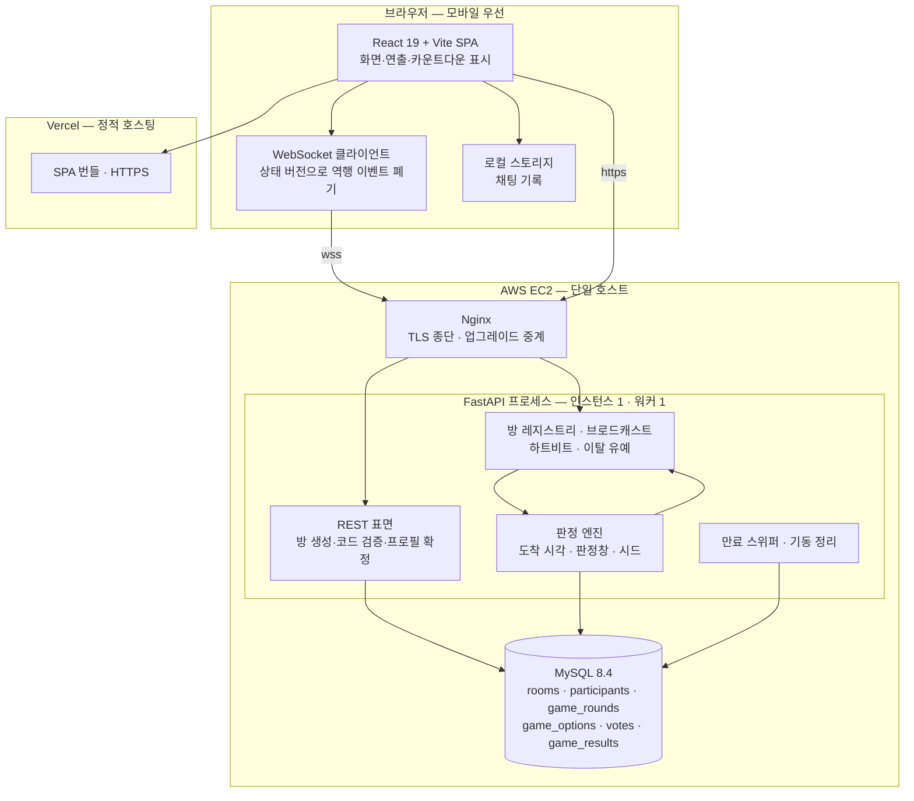

# 04_architecture — 시스템 아키텍처

> **대상**: ModuPick — 시스템 구조 · 실시간 WebSocket · 판정 엔진 · 시간과 타이밍 · 방 상태 머신 · 인메모리↔DB 경계 · 배포 구성 · 기술 결정(ADR)의 정본
> **작성일**: 2026-08-02
> **원천**: docs_legacy/requirements.md §3.1(G-1~16) · §5(NFR-01~10) · §6(설계 결정) · git 529e312 docs/db.md §10~12 · §19~23 · git 529e312 docs/api.md(연결 수명주기) · git ecceb11 docs/03_architecture/00_tech_stack.md · 01_data_model.md · docs/06_api/02_socket.md §1 · docs/09_deployment/00_overview.md · backend/app/ · frontend/src/lib/store.ts · [../README.md](../README.md)(고정 기준·전역 불변식)

ModuPick의 **구조와 그 구조를 만든 결정**을 담는 폴더다. 프론트엔드는 **React 19 + Vite** SPA로 Vercel에, 백엔드는 **FastAPI** 단일 프로세스로 AWS EC2에, DB는 **MySQL 8.4** 컨테이너로 같은 호스트에 놓인다. 대기방 진입 이후의 전 기능은 WebSocket 위에서 돌아가고, 게임 결과는 예외 없이 서버가 확정한다.

이 구조의 성격은 한 문장으로 요약된다 — **판정에 필요한 것은 메모리에 두고 남겨야 하는 것만 DB에 쓴다.** 밀리초 순서를 다투는 경로에 DB 왕복을 넣지 않기 위해 진행 중 상태를 프로세스 메모리에 두었고, 그 선택이 **단일 인스턴스·워커 1개**와 **무중단 배포 포기**를 강제한다. 이 폴더의 다른 결정 대부분은 그 대가를 감당하는 방법이다.

## 파일 목차

| 파일 | 내용 |
|------|------|
| [01_system_architecture.md](./01_system_architecture.md) | 전체 구성도 · 컴포넌트 책임 · 요청 흐름과 이벤트 흐름 · 프론트/백엔드 경계 · 범위 경계 |
| [02_realtime_websocket.md](./02_realtime_websocket.md) | 연결 수명주기 · 방 단위 라우팅 · 브로드캐스트 · **하트비트와 이탈 유예** · 순서 보장 · 전송 실패 처리 |
| [03_judgment_engine.md](./03_judgment_engine.md) | 판정 엔진 구조 · 입력 수집과 도착 시각 기록 · 멱등 처리 · 난수와 시드 · 게임별 판정 호출 규약 |
| [04_time_and_timing.md](./04_time_and_timing.md) | 시각 표준 · 서버 타이머 주체 · 제한 시간 동기화 · 지터의 영향과 대응 · 시간초 예외의 검증 |
| [05_room_state_machine.md](./05_room_state_machine.md) | 방 상태 4종 전이도 · **(상태 × 이벤트) 전표** · 상태별 허용·거부 동작 |
| [06_memory_persistence_split.md](./06_memory_persistence_split.md) | 인메모리↔DB 경계 정본 · 데이터별 소재 표 · 정합 유지 규칙 · **서버 재시작 시 고아 방 정리** |
| [07_deployment_topology.md](./07_deployment_topology.md) | 배치 구성 · Nginx WebSocket 프록시 · 도메인과 TLS · 배포와 롤백 · **비기능 목표 판정** · **부하 특성 추정** · 모니터링 |
| [08_decision_records.md](./08_decision_records.md) | **기술 결정 ADR-01~27**(채번 유일 정본) |

## 아키텍처 한눈

**진행 중 상태는 HUB와 ENG의 메모리 안에만 있다.** 클라이언트는 결과를 만들지 않고 서버가 확정한 결과로 수렴하는 연출만 그린다.

## 핵심 제약

| 제약 | 내용 | 근거 |
|------|------|------|
| 단일 프로세스 | 인스턴스 1 · 워커 1. 수평 확장·오토스케일링·무중단 배포를 하지 않는다 | 진행 중 상태가 프로세스 메모리에 있다(ADR-02 · ADR-04) |
| Redis 미사용 | 공유 상태 저장소를 두지 않는다 | 밀리초 경로에 왕복이 하나 더 생기고 방 수명이 분 단위다(ADR-02) |
| Kubernetes 미채택 | Docker Compose + 단일 호스트 | replicas 1 고정·무중단 배포 불가라 이점이 남지 않는다(ADR-03) |
| 재접속 없음 | 끊긴 사람은 돌아올 수 없고 후보로만 남는다 | 상태 복구 경로를 두지 않기로 했다(ADR-09) |
| 방장 비이양 | 방장이 이탈 확정되면 방이 삭제된다 | 룰렛·사다리는 입력 주체가 방장뿐이다(ADR-09) |
| 판정 경로에 DB 금지 | DB에 기록하는 입력은 집계용 표뿐이다 | 지터보다 큰 지연을 판정에 넣지 않는다(ADR-04) |
| wss 필수 | 백엔드 도메인과 TLS 인증서가 첫 통합 배포의 선결 조건이다 | 프론트가 HTTPS라 평문 소켓이 차단된다(ADR-22) |
| 배포는 곧 방 소멸 | 백엔드 배포·재기동 시 진행 중 방이 전부 사라진다 | 인메모리 상태 + 단일 인스턴스(ADR-24 · ADR-20) |

## 본 폴더가 확정한 값

원천에 정의가 없어 본 문서군이 새로 정한 값이다. 다른 문서는 이 값을 인용한다.

| 항목 | 값 | 정본 |
|------|-----|------|
| 하트비트 | WebSocket 제어 프레임 ping · **20초** 주기 | [02_realtime_websocket.md](./02_realtime_websocket.md) |
| pong 대기 | **60초**(3주기) 무응답이면 연결 의심 | [02_realtime_websocket.md](./02_realtime_websocket.md) |
| 이탈 유예 | 참가자 **30초** · 방장 **60초** | [02_realtime_websocket.md](./02_realtime_websocket.md) |
| 이탈 확정 최대 지연 | 참가자 **90초** · 방장 **120초** | [02_realtime_websocket.md](./02_realtime_websocket.md) |
| 미연결 슬롯 해제 | 참가 등록 후 **15초** | [02_realtime_websocket.md](./02_realtime_websocket.md) |
| 시간초 도착 시각 허용 오차 | **±300밀리초**(값의 정본은 게임 규칙 문서. 본 폴더는 검증 방법을 담는다) | [04_time_and_timing.md](./04_time_and_timing.md) |
| 동시 판정 단위 | 게임 설정의 **판정창**(300·500밀리초). ±10밀리초 구분은 폐기 | [04_time_and_timing.md](./04_time_and_timing.md) |
| 만료 스위퍼 주기 | **60초** | [06_memory_persistence_split.md](./06_memory_persistence_split.md) |
| Nginx 읽기 타임아웃 | **75초** | [07_deployment_topology.md](./07_deployment_topology.md) |
| 부하 목표 | 동시 **100방 · 1,000연결**(추정 판정 · 실측 전) | [07_deployment_topology.md](./07_deployment_topology.md) |

## 아키텍처 불변식

| 불변식 | 강제 지점 |
|--------|-----------|
| 결과는 서버가 확정하고 클라이언트는 수렴만 한다 | 판정 엔진이 순수 함수이며 클라이언트 입력에 결과 필드가 없다 |
| 시간·순서 판정의 기준은 서버 도착 시각이다 | 도착 시각을 프로세스 단조 시계로 찍고 클라이언트 시각을 판정에 넣지 않는다. 예외는 시간초 경과 시간 하나뿐이며 서버가 범위 검증한다 |
| 밀리초 판정 경로에 DB 왕복이 없다 | 시간 판정 입력은 인메모리에서 처리하고 확정 결과만 기록한다 |
| 같은 입력은 최초 1회만 인정된다 | 요청 식별자 + 라운드·단계·반복 회차 일치 2중 검사 |
| 전원이 같은 결과를 같은 순간에 본다 | 확정 후 방 단위 1회 직렬화 · 수신자별 독립 팬아웃 · 확인 응답 대기 없음 |
| 화면이 과거 상태로 되돌아가지 않는다 | 방 상태 버전 단조 증가 · 역행 이벤트 폐기 |
| 백그라운드 전환이 이탈이 아니다 | 하트비트가 제어 프레임이라 JS 스로틀링과 무관하고, 페이지 숨김으로 나가기를 보내지 않는다 |
| 종료가 보장되지 않는 반복이 없다 | 결선·재대결·무효 라운드 재시작 상한 3회 + 방장 선택 탈출 |
| 재기동 후 고아 방이 남지 않는다 | 기동 시 DB의 방을 전량 정리한 뒤에야 준비 상태를 올린다 |
| 방이 사라지면 흔적이 남지 않는다 | 방 삭제 시 하위 데이터가 함께 삭제되고 시드도 지워진다 |

## 읽는 순서

1. **구조 파악** — [01_system_architecture.md](./01_system_architecture.md) → [06_memory_persistence_split.md](./06_memory_persistence_split.md)
2. **실시간 구현** — [02_realtime_websocket.md](./02_realtime_websocket.md) → [05_room_state_machine.md](./05_room_state_machine.md)
3. **게임 구현** — [03_judgment_engine.md](./03_judgment_engine.md) → [04_time_and_timing.md](./04_time_and_timing.md) → [../05_game_rules/README.md](../05_game_rules/README.md)
4. **배포** — [07_deployment_topology.md](./07_deployment_topology.md)
5. 왜 그렇게 정했는지가 궁금하면 언제든 → [08_decision_records.md](./08_decision_records.md)

## 관련 문서

- 문서 지도·고정 기준·전역 불변식 → [../README.md](../README.md)
- 게임 규칙 정본 → [../05_game_rules/README.md](../05_game_rules/README.md)
- 스키마 정본 → [../06_database/README.md](../06_database/README.md)
- WebSocket 이벤트 정본 → [../07_api/03_socket_events.md](../07_api/03_socket_events.md)
- 권한 매트릭스 → [../02_features/08_permission_matrix.md](../02_features/08_permission_matrix.md)
- 기술 스택 선정 사유 → [../09_tech_stack/README.md](../09_tech_stack/README.md)
- 공정성·서버 권위 → [../11_fairness/01_server_authority.md](../11_fairness/01_server_authority.md)
- 용어·에러 코드·ID 규약 → [../10_glossary/README.md](../10_glossary/README.md)
