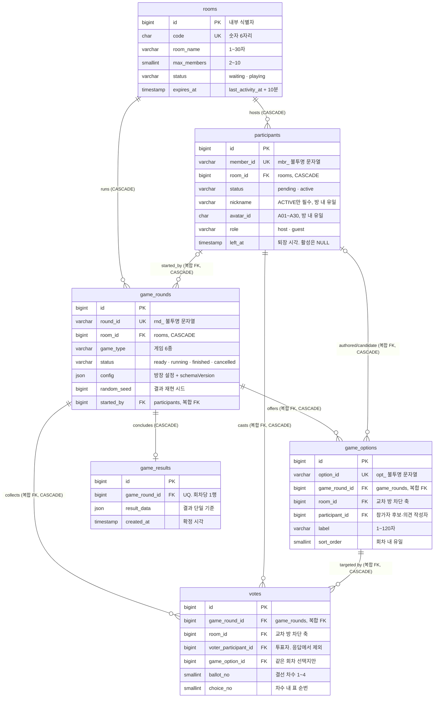

# 01_erd — 개체·관계 다이어그램

> **대상**: ModuPick — 6테이블의 관계·카디널리티·CASCADE 삭제 경로
> **작성일**: 2026-08-02
> **원천**: git 529e312 docs/db.md §5·§3 ERD와 §8·v0.5 §4 최종 DDL · git 529e312 docs/db.md「개발 전 반드시 정리할 문제」1(교차 방 참조) · [README.md](./README.md)(경계·집계)

관계의 척추는 **rooms 하나**다. 방이 사라지면 그 아래가 전부 사라지고, 방 밖으로 이어지는 참조는 없다. 소유자·계정 축이 없으므로 전역 자원 테이블도 없다. 본 문서는 관계와 삭제 경로만 고정하고, 컬럼 명세는 [02_rooms_participants.md](./02_rooms_participants.md) · [03_game_rounds.md](./03_game_rounds.md) · [04_options_votes_results.md](./04_options_votes_results.md)가 담는다.

## 전역 ERD



## 관계와 카디널리티

| # | 관계 | cardinality | 참조 형태 | ON DELETE | 의미 |
|:-:|------|:-----------:|-----------|:---------:|------|
| 1 | rooms → participants | 1 : 2~10 | 단일 room_id | **CASCADE** | 방의 참가자. 정원 상한은 DB CHECK가 아니라 입장 트랜잭션이 강제한다 |
| 2 | rooms → game_rounds | 1 : 0..N | 단일 room_id | **CASCADE** | 방에서 돌린 판. 진행 중인 판은 **최대 1개**(UNIQUE) |
| 3 | participants → game_rounds | 0..1 : 0..N | 복합 (started_by, room_id) | **CASCADE** | 판을 시작한 방장. 같은 방 참가자만 들어간다 |
| 4 | game_rounds → game_options | 1 : 0..N | 복합 (game_round_id, room_id) | **CASCADE** | 판의 선택지. 게임에 따라 0개다 |
| 5 | participants → game_options | 0..1 : 0..N | 복합 (participant_id, room_id) | **CASCADE** | 참가자 후보(룰렛·저격) 또는 의견 작성자(킹메이커). 사다리 항목은 NULL |
| 6 | game_rounds → votes | 1 : 0..N | 복합 (game_round_id, room_id) | **CASCADE** | 판의 표. 투표를 쓰지 않는 게임은 0개다 |
| 7 | participants → votes | 1 : 0..N | 복합 (voter_participant_id, room_id) | **CASCADE** | 투표자. 익명 게임에서도 저장하되 응답·로그에서 제외한다 |
| 8 | game_options → votes | 1 : 0..N | 복합 (game_option_id, game_round_id) | **CASCADE** | 표가 가리키는 선택지. **다른 회차 선택지에 투표할 수 없다** |
| 9 | game_rounds → game_results | 1 : 0..1 | 단일 game_round_id (UNIQUE) | **CASCADE** | 확정 결과. 판당 최대 1행 |

- **FK 9개 전부 CASCADE다.** SET NULL·RESTRICT를 하나도 쓰지 않는다 — 방 밖으로 존속해야 할 데이터가 없기 때문이다. 방이 사라지면 남길 것이 없다는 제품 결정(docs_legacy/requirements.md D-38 · NFR-09)이 FK 정책 하나로 표현된다.
- **참가자를 참조하는 FK 3개는 전부 복합이다**(#3 · #5 · #7). room_id를 참조 축에 끼워 넣어 다른 방 참가자가 끼어드는 경로를 DB가 직접 막는다. 근거와 대안 비교는 [05_constraints_integrity.md](./05_constraints_integrity.md)에 있다.
- **participant_id·started_by가 NULL인 행은 FK 검사를 통과한다.** MySQL은 복합 FK의 어느 한 컬럼이라도 NULL이면 제약을 만족한 것으로 본다. 사다리 도착 항목(participant_id NULL)이 이 경로로 들어간다.

## CASCADE 삭제 경로

방 삭제는 **rooms 행 1개를 지우는 한 문장**이며 나머지는 InnoDB가 처리한다. 삭제 깊이는 최대 3단이다.

```
DELETE FROM rooms WHERE id = ?
│
├─ participants                       (fk_participants_room · room_id)
│    ├─ game_rounds                   (fk_game_rounds_started_by · started_by, room_id)
│    │    ├─ game_options             (fk_game_options_round)
│    │    ├─ votes                    (fk_votes_round)
│    │    └─ game_results             (fk_game_results_round)
│    ├─ game_options                  (fk_game_options_participant · participant_id, room_id)
│    └─ votes                         (fk_votes_voter · voter_participant_id, room_id)
│
└─ game_rounds                        (fk_game_rounds_room · room_id)
     ├─ game_options                  (fk_game_options_round · game_round_id, room_id)
     │    └─ votes                    (fk_votes_option · game_option_id, game_round_id)
     ├─ votes                         (fk_votes_round · game_round_id, room_id)
     └─ game_results                  (fk_game_results_round · game_round_id)
```

- **game_options·votes·game_rounds는 삭제 경로가 둘 이상인 다이아몬드 구조다.** 참가자를 거치는 경로와 방·회차를 직접 거치는 경로가 같은 행에 도달한다. InnoDB의 CASCADE는 이미 지워진 행을 다시 지우려 하지 않으므로 결과는 같지만, **경로 중복은 실제 MySQL 8.4에서 실행해 확인해야 하는 항목**이다([07_migrations_seed.md](./07_migrations_seed.md)의 배포 전 검증 목록).
- **개별 참가자를 물리 삭제하는 경로를 두지 않는다.** 퇴장·강퇴·연결 종료는 participants.left_at 갱신이며, 물리 삭제는 위 방 삭제 CASCADE 하나뿐이다. 참가자 한 명을 직접 DELETE하면 그 사람의 표가 함께 사라지므로, 애플리케이션에 삭제 메서드를 두지 않고 modupick_app 계정에서 participants DELETE 권한을 회수한다([07_migrations_seed.md](./07_migrations_seed.md)).
- **삭제 사유를 기록하는 묘비 테이블을 두지 않는다.** 방장 이탈·마지막 참가자 이탈·10분 무활동을 구분해야 하는 대상은 그 순간 접속해 있는 참가자뿐이며, 그들에게는 인메모리가 아는 사유를 소켓 이벤트로 알린다. 나중에 코드로 접근하는 사람에게는 세 경우가 모두 "없는 방"이라 구분할 실익이 없다.

## 방 밖으로 나가는 참조가 없다는 것

| 확인 축 | 결과 |
|---------|------|
| 방 사이 참조 | 없다. 모든 FK가 같은 방 안에서 닫힌다(복합 FK가 room_id를 강제) |
| 계정·소유자 축 | 없다. users 테이블이 없고 참가자는 방 내부에서만 유효하다 |
| 전역 카탈로그 참조 | 없다. 게임 메타 6종·아바타 30종은 정적 애플리케이션 데이터라 테이블이 아니다 |
| 자기 참조 | 없다. 계층 구조를 가진 테이블이 없다 |
| 순환 참조 | 없다. 방향이 rooms → participants·game_rounds → game_options·votes·game_results 한 방향이다 |

이 성질 덕분에 **방 하나가 완결된 삭제 단위**가 되고, 개인정보 수명이 방 수명과 정확히 같아진다(docs_legacy/requirements.md NFR-08·NFR-09).

## 관련 문서

- 테이블별 컬럼 명세 → [02_rooms_participants.md](./02_rooms_participants.md) · [03_game_rounds.md](./03_game_rounds.md) · [04_options_votes_results.md](./04_options_votes_results.md)
- 복합 FK의 근거·제약 전수 → [05_constraints_integrity.md](./05_constraints_integrity.md)
- 방 삭제 트랜잭션·잠금 순서 → [06_transactions_concurrency.md](./06_transactions_concurrency.md)
- 배포 전 CASCADE 실행 검증 → [07_migrations_seed.md](./07_migrations_seed.md)
- 인메모리↔DB 경계 요약 → [README.md](./README.md)
