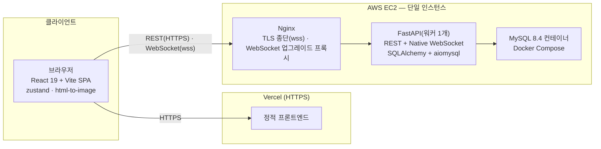

# 09_tech_stack — 기술 스택

> **대상**: ModuPick(모두픽) — 링크 하나로 모여 미니게임 6종으로 팀장·역할·안건을 정하는 실시간 팀 의사결정 웹 서비스
> **작성일**: 2026-08-02
> **원천**: frontend/package.json · backend/requirements.txt · frontend/vite.config.ts · frontend/tsconfig.app.json · frontend/.oxlintrc.json · backend/app/main.py · backend/app/config.py · docs_legacy/techstack.md · git 529e312(docs/db.md §3·§19~22) · git ecceb11(docs/03_architecture/00_tech_stack.md · docs/09_deployment/00_overview.md) · [../README.md](../README.md)(고정 기준·전역 불변식)

ModuPick이 채택하는 기술 스택을 계층별로 정리한다. 선정 이유와 폐기된 대안의 근거는 [04_decisions_rationale.md](./04_decisions_rationale.md)에 둔다. 버전은 전부 저장소의 실제 의존성 파일에서 실측했다.

## 파일 목차

| 파일 | 내용 |
|------|------|
| [01_frontend.md](./01_frontend.md) | React 19 · Vite · TypeScript · zustand · 폰트 4종(@fontsource) · html-to-image. 실제 버전과 역할, 빌드·개발 명령 |
| [02_backend.md](./02_backend.md) | Python · FastAPI · Native WebSocket · SQLAlchemy · aiomysql · Alembic. 실제 버전, 실행 명령(개발·운영), 단일 인스턴스·워커 1개 제약 |
| [03_database_infra.md](./03_database_infra.md) | MySQL 8.4 설정·문자셋·시간대·연결 풀 · Docker Compose 구성 · EC2 사양 권고 · Nginx WebSocket 프록시 · 도메인과 TLS |
| [04_decisions_rationale.md](./04_decisions_rationale.md) | 대안 비교와 선정 근거 표. 채택·보류·폐기(Kubernetes · Redis · PostgreSQL · Socket.IO)를 근거와 함께 기록 |

## 스택 한눈에

| 레이어 | 기술 | 버전 | 용도 |
|--------|------|------|------|
| 프론트 프레임워크 | **React** | 19.2.7(react-dom 동일) | UI 렌더링·컴포넌트 트리 |
| 빌드 도구 | **Vite** | 8.1.1 | 개발 서버·번들링 |
| 빌드 플러그인 | @vitejs/plugin-react | 6.0.3 | React Fast Refresh |
| 언어(프론트) | **TypeScript** | ~6.0.2 | 정적 타입 |
| 상태 관리 | **zustand** | 5.0.14 | 화면 전환·방·게임 진행 상태를 담는 클라이언트 스토어 |
| 폰트 | @fontsource 4종(black-han-sans · do-hyeon · gothic-a1 · nanum-gothic-coding) | 5.3.0 | 셀프호스팅 한글 폰트 |
| 이미지 캡처 | html-to-image | 1.11.13 | 결과 카드를 PNG로 저장 |
| 린터(프론트) | oxlint | 1.71.0 | 정적 분석 |
| 배포(프론트) | **Vercel** | — | Git 연동 자동 배포, HTTPS 기본 제공 |
| 언어(백엔드) | **Python** | 3.14(로컬 개발 가상환경 실측) | 백엔드 런타임 |
| 프레임워크(백엔드) | **FastAPI** | 0.141.1(starlette 1.3.1) | REST + WebSocket API |
| ASGI 서버 | uvicorn | 0.52.1(uvloop 0.22.1 포함) | 운영 실행 |
| 실시간 프로토콜 | **Native WebSocket** | websockets 17.0.1 | 방 단위 이벤트 브로드캐스트 |
| ORM | **SQLAlchemy** | 2.0.51 | 비동기 ORM |
| DB 드라이버 | **aiomysql** | 0.3.2 | MySQL 비동기 드라이버(PyMySQL 1.2.0은 Alembic 동기 경로용) |
| 마이그레이션 | **Alembic** | 1.18.5 | 스키마 버전 관리 |
| 검증·설정 | pydantic / pydantic-settings | 2.13.4 / 2.14.2 | 요청 스키마 검증·환경변수 로딩 |
| 배포(백엔드) | **AWS EC2**(Docker Compose) | — | 단일 인스턴스·워커 1개 고정 |
| 데이터베이스 | **MySQL** | 8.4(LTS) | 방·참가자·라운드·선택지·투표·확정 결과 영속 저장 |
| 리버스 프록시 | **Nginx** | — | TLS 종단·WebSocket 업그레이드 프록시 |
| CI | GitHub Actions | — | 빌드·린트·테스트(.github/workflows/ci-backend.yml · ci-frontend.yml). 배포 자동화는 아니다 |

## 아키텍처 개요

프론트는 Vercel이 HTTPS로 서빙하고, 백엔드는 EC2 한 대 위에서 Nginx가 TLS를 종단해 FastAPI(워커 1개)로 넘긴다. Vercel의 HTTPS 페이지가 브라우저 혼합 콘텐츠 정책 때문에 비보안 WebSocket(ws)에 연결할 수 없으므로 wss가 필수이며, 그 근거와 절차는 [03_database_infra.md](./03_database_infra.md)에 둔다. 방 상태가 FastAPI 프로세스 메모리에 있어 인스턴스·워커를 늘리지 않는다 — 근거는 [04_decisions_rationale.md](./04_decisions_rationale.md).

## 관련 문서

- [../04_architecture/README.md](../04_architecture/README.md) — 시스템 구조·WebSocket·인메모리↔DB 경계·기술결정(ADR)
- [../06_database/README.md](../06_database/README.md) — ERD·테이블 명세
- [../01_overview/06_design_decisions.md](../01_overview/06_design_decisions.md) — 확정된 제품 결정(D-NN)
- [../04_architecture/08_decision_records.md](../04_architecture/08_decision_records.md) — 기술 결정(ADR)
