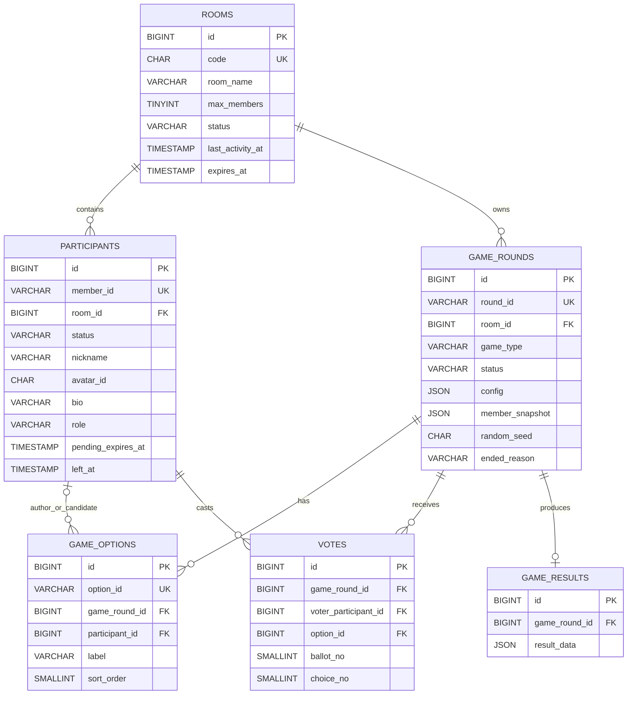
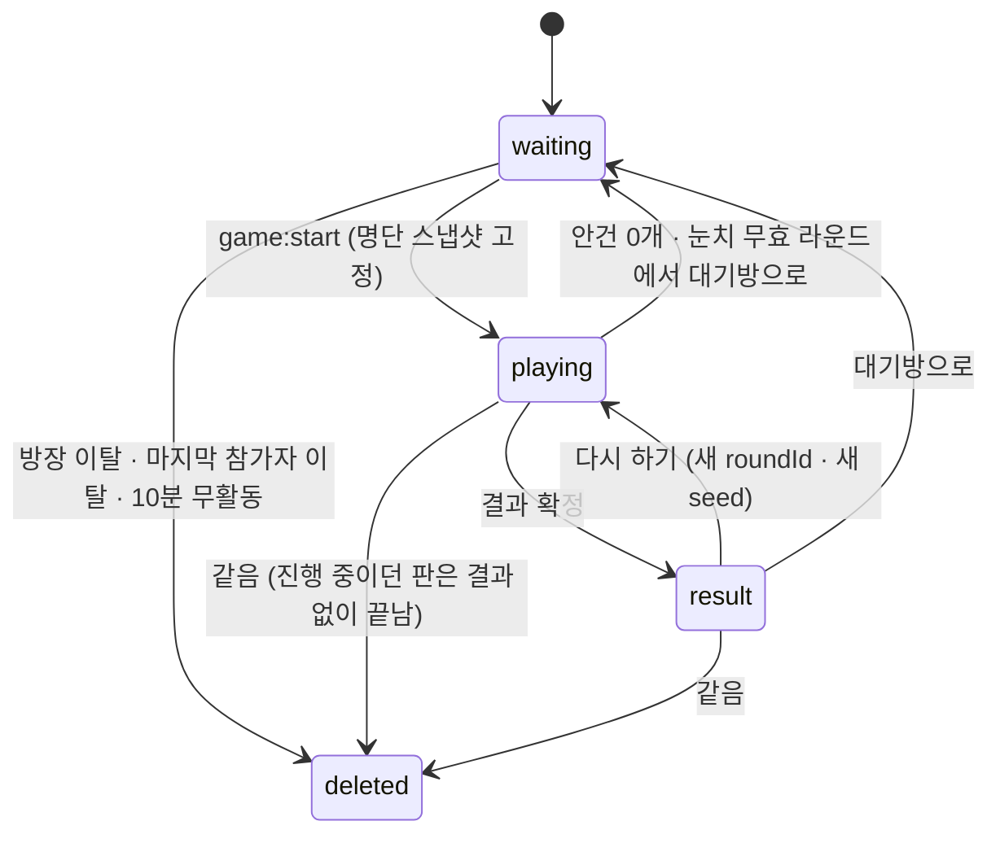

# ModuPick DB 설계서

> 데이터가 **어디에 어떤 모양으로 쌓이고, 언제 사라지는가**를 정의한다.
> `requirements.md`의 규칙을 스키마와 트랜잭션으로 옮긴 결과물이다.

| | |
|---|---|
| 최종 수정 | 2026-07-30 |
| DBMS | MySQL 8.4 (InnoDB · `utf8mb4_0900_ai_ci`) |
| 앞선 문서 | [`requirements.md`](requirements.md) — 사용자가 무엇을 하고 싶은가 **★정본** |
| | [`features.md`](features.md) — 그러려면 무엇을 만들어야 하나 |
| 짝 문서 | [`api.md`](api.md) — 같은 계약의 인터페이스 쪽 |

스펙이 어긋나면 `requirements.md`가 이긴다. 이 문서는 그 결정을 스키마로 옮긴 결과이며,
저장 구조를 정하는 과정에서 새로 생긴 **구현 결정은 §16에 `DB-` 번호로** 남긴다.

---

## 1. 적용 원칙

| # | 원칙 |
|---|---|
| P-1 | 테이블은 **6개**다. `rooms` · `participants` · `game_rounds` · `game_options` · `votes` · `game_results` |
| P-2 | **앱 서버는 단일 인스턴스(`replicas=1`)로만 운영한다.** 진행 상태를 프로세스 메모리에 두기 때문이다(§2). Kubernetes를 쓰더라도 이 값을 늘리면 같은 방 참가자가 서로 다른 상태를 보게 된다 |
| P-3 | DB에는 **방·참가자·판·선택지·표·최종 결과**만 남긴다. 진행 중 입력과 실시간 상태는 메모리에 둔다(§2) |
| P-4 | 게임 시작 시 ACTIVE 참가자 전원을 `game_rounds.member_snapshot`에 복사해 그 판의 명단을 고정한다(G-5) |
| P-5 | 참가자가 게임 중 이탈해도 snapshot·후보·결과에 남고 새 입력만 막는다(D-10 · F-407). 입력하지 않은 사람은 게임별 기본값으로 처리한다(G-7 · F-408) |
| P-6 | 방장이 나가거나 소켓이 끊기면 **어느 상태에서든 방을 즉시 삭제**한다. 권한을 위임하지 않는다(G-16 · D-12) |
| P-7 | 강퇴된 사람을 식별하는 브라우저 키를 저장하지 않는다. `waiting`이면 새 `member_id`로 다시 들어올 수 있다(US-204.2 · NFR-08) |
| P-8 | 프로필은 `pending` → `active` 전환 시 **한 번만** 확정한다(US-104.5) |
| P-9 | 시간 판정은 클라이언트 시각이 아니라 **서버 ingress 도착 시각**을 쓴다(G-8 · D-05) |
| P-10 | 결과와 난수 시드는 방 수명 동안 보관하되 **과거 결과를 다시 조회하는 경로를 만들지 않는다**(US-504.2 · F-507) |
| P-11 | 모든 상태 변경 이벤트는 **트랜잭션 commit 이후** 발행한다 |
| P-12 | 방 삭제 외에는 참가자를 물리 DELETE하지 않고 `left_at`만 갱신한다 |

---

## 2. 저장 경계 — 무엇이 DB에 남고 무엇이 안 남는가

| 데이터 | 위치 | 근거 |
|---|---|---|
| 방·참가자·판·선택지·표·최종 결과·난수 시드 | **MySQL** | G-13 · US-504 |
| 준비(Ready) 상태 | 메모리 | 방 수명 안에서만 의미가 있고 대기방 복귀 때 초기화된다 |
| 소켓 세션·연결 매핑 | 메모리 | 재접속이 없어 복구 대상이 아니다(G-6 · D-09) |
| `phase`·제한 시간 타이머 | 메모리 | 진행 중에만 필요하다 |
| 진행 중 입력 — 시간초 `START`/`STOP`, 눈치 `UP`, 킹메이커 제출 전 초안 | 메모리 | 판정이 끝나면 결과가 `game_results`로 확정된다 |
| 결선 회차의 유효 후보 집합 | 메모리 | `ballot_no`로 표는 남고, 후보 집합은 서버가 직전 회차 득표로 결정한다(§13.2) |
| `roomVersion` | 메모리 | 이벤트 순서 판별용 카운터이며 영속 대상이 아니다 |
| 채팅 | **저장하지 않음** | 서버는 중계만 하고 각자 브라우저에 쌓인다(D-40 · F-204) |

> **이 경계의 대가** — 서버를 재시작하면 진행 중이던 판은 이어갈 수 없다. 방 수명이 10분이고
> 재접속 자체가 없는 설계(G-6)라 감수한다. 대신 `다시 하기`가 쓸 설정은 메모리가 아니라
> **직전 `game_rounds` 행에서 읽어** 재시작 후에도 어긋나지 않게 한다(`DB-06`).

---

## 3. ERD



---

## 4. 값 표기 규칙

**저장값과 노출값은 항상 같다.** 서비스 계층에 대소문자 변환 지점을 두지 않는다(`DB-01`).

| 종류 | 표기 | 예 |
|---|---|---|
| 상태·종류 enum | **소문자** | `rooms.status` = `waiting` · `participants.status` = `pending` · `game_type` = `roulette` |
| 사유·판정 enum | **대문자** | `ended_reason` = `NO_OPTIONS` · 눈치 `verdict` = `SAFE` |
| 순수 프로토콜 상수 (DB에 없음) | **대문자** | `phase` = `VOTE` · `reason` = `KICKED` · 오류 `code` = `ROOM_FULL` |

사유·판정 enum이 대문자인 것은 **그 값이 그대로 소켓 `reason`·`verdict`로 나가기 때문**이다.
같은 필드가 계층마다 다른 표기를 갖지 않도록 저장 쪽을 노출 쪽에 맞춘다.

**방 코드**는 DB·API 경로·소켓 룸 키 모두 **숫자 6자리**로 다루고,
`MODU-` 접두어는 화면과 복사되는 초대 코드에서만 붙인다(`DB-02` · US-101.4).

---

## 5. DDL

```sql
-- ─────────────────────────────────────────────────────────────
-- rooms — 방                                    F-101 · F-102 · F-210 · F-211 · F-604
-- ─────────────────────────────────────────────────────────────
CREATE TABLE rooms (
  id BIGINT UNSIGNED NOT NULL AUTO_INCREMENT,
  code CHAR(6) CHARACTER SET ascii COLLATE ascii_bin NOT NULL,
  room_name VARCHAR(30) NOT NULL DEFAULT 'ModuPick 방',
  max_members TINYINT UNSIGNED NOT NULL DEFAULT 10,
  status VARCHAR(12) NOT NULL DEFAULT 'waiting',
  created_at TIMESTAMP(3) NOT NULL DEFAULT CURRENT_TIMESTAMP(3),
  last_activity_at TIMESTAMP(3) NOT NULL DEFAULT CURRENT_TIMESTAMP(3),
  expires_at TIMESTAMP(3) NOT NULL,
  updated_at TIMESTAMP(3) NOT NULL DEFAULT CURRENT_TIMESTAMP(3)
    ON UPDATE CURRENT_TIMESTAMP(3),
  CONSTRAINT pk_rooms PRIMARY KEY (id),
  CONSTRAINT uq_rooms_code UNIQUE (code),
  CONSTRAINT ck_rooms_code_format
    CHECK (REGEXP_LIKE(code, '^[0-9]{6}$', 'c')),
  CONSTRAINT ck_rooms_name
    CHECK (CHAR_LENGTH(TRIM(room_name)) BETWEEN 1 AND 30),
  CONSTRAINT ck_rooms_max_members
    CHECK (max_members BETWEEN 2 AND 10),
  CONSTRAINT ck_rooms_status
    CHECK (status IN ('waiting', 'playing', 'result')),
  INDEX idx_rooms_expires_at (expires_at)
) ENGINE=InnoDB DEFAULT CHARSET=utf8mb4 COLLATE=utf8mb4_0900_ai_ci;

-- ─────────────────────────────────────────────────────────────
-- participants — 참가자           F-108 · F-109 · F-110 · F-201 · F-208 · F-209
-- ─────────────────────────────────────────────────────────────
CREATE TABLE participants (
  id BIGINT UNSIGNED NOT NULL AUTO_INCREMENT,
  member_id VARCHAR(40) CHARACTER SET ascii COLLATE ascii_bin NOT NULL,
  room_id BIGINT UNSIGNED NOT NULL,
  status VARCHAR(10) NOT NULL DEFAULT 'pending',
  nickname VARCHAR(8) NULL,
  avatar_id CHAR(3) CHARACTER SET ascii COLLATE ascii_bin NULL,
  bio VARCHAR(24) NULL,
  role VARCHAR(10) NOT NULL,
  joined_at TIMESTAMP(3) NOT NULL DEFAULT CURRENT_TIMESTAMP(3),
  pending_expires_at TIMESTAMP(3) NULL,
  left_at TIMESTAMP(3) NULL,

  -- 활성 참가자에게만 값이 생기는 가상 컬럼. 방 안에서의 유일성을 DB로 보장한다.
  active_nickname VARCHAR(8)
    GENERATED ALWAYS AS (
      CASE
        WHEN status = 'active' AND left_at IS NULL
        THEN LOWER(nickname)
        ELSE NULL
      END
    ) VIRTUAL,
  active_avatar_id CHAR(3) CHARACTER SET ascii COLLATE ascii_bin
    GENERATED ALWAYS AS (
      CASE
        WHEN status = 'active' AND left_at IS NULL
        THEN avatar_id
        ELSE NULL
      END
    ) VIRTUAL,
  active_host_guard TINYINT
    GENERATED ALWAYS AS (
      CASE
        WHEN status = 'active' AND role = 'host' AND left_at IS NULL
        THEN 1
        ELSE NULL
      END
    ) VIRTUAL,

  updated_at TIMESTAMP(3) NOT NULL DEFAULT CURRENT_TIMESTAMP(3)
    ON UPDATE CURRENT_TIMESTAMP(3),
  CONSTRAINT pk_participants PRIMARY KEY (id),
  CONSTRAINT uq_participants_member_id UNIQUE (member_id),
  CONSTRAINT fk_participants_room FOREIGN KEY (room_id)
    REFERENCES rooms(id) ON DELETE CASCADE,
  CONSTRAINT ck_participants_member_id
    CHECK (REGEXP_LIKE(member_id, '^mbr_[A-Za-z0-9]+$', 'c')),
  CONSTRAINT ck_participants_status
    CHECK (status IN ('pending', 'active')),
  CONSTRAINT ck_participants_role
    CHECK (role IN ('host', 'guest')),
  CONSTRAINT ck_participants_profile_state CHECK (
    (
      status = 'pending'
      AND nickname IS NULL
      AND avatar_id IS NULL
      AND bio IS NULL
    )
    OR
    (status = 'active' AND nickname IS NOT NULL AND avatar_id IS NOT NULL)
  ),
  -- 닉네임은 1~8자이며 공백 문자를 포함할 수 없다 (D-44)
  CONSTRAINT ck_participants_nickname CHECK (
    nickname IS NULL
    OR REGEXP_LIKE(nickname, '^[^[:space:]]{1,8}$', 'c')
  ),
  CONSTRAINT ck_participants_bio CHECK (
    bio IS NULL OR CHAR_LENGTH(bio) <= 24
  ),
  -- 아바타는 A01~A30 30종 (D-45)
  CONSTRAINT ck_participants_avatar CHECK (
    avatar_id IS NULL
    OR REGEXP_LIKE(avatar_id, '^A(0[1-9]|[12][0-9]|30)$', 'c')
  ),
  CONSTRAINT ck_participants_pending_expiry CHECK (
    (status = 'pending' AND pending_expires_at IS NOT NULL)
    OR (status = 'active' AND pending_expires_at IS NULL)
  ),
  CONSTRAINT uq_participants_active_nickname
    UNIQUE (room_id, active_nickname),
  CONSTRAINT uq_participants_active_avatar
    UNIQUE (room_id, active_avatar_id),
  CONSTRAINT uq_participants_active_host
    UNIQUE (room_id, active_host_guard),
  INDEX idx_participants_room_active (room_id, left_at, status),
  INDEX idx_participants_pending_expiry (pending_expires_at)
) ENGINE=InnoDB DEFAULT CHARSET=utf8mb4 COLLATE=utf8mb4_0900_ai_ci;

-- ─────────────────────────────────────────────────────────────
-- game_rounds — 게임 한 판                F-311 · F-401 · F-505 · F-507 · F-604
-- ─────────────────────────────────────────────────────────────
CREATE TABLE game_rounds (
  id BIGINT UNSIGNED NOT NULL AUTO_INCREMENT,
  round_id VARCHAR(40) CHARACTER SET ascii COLLATE ascii_bin NOT NULL,
  room_id BIGINT UNSIGNED NOT NULL,
  game_type VARCHAR(30) NOT NULL,
  status VARCHAR(20) NOT NULL,
  config JSON NOT NULL,
  member_snapshot JSON NOT NULL,
  random_seed CHAR(64) CHARACTER SET ascii COLLATE ascii_bin NOT NULL,
  started_by BIGINT UNSIGNED NULL,
  created_at TIMESTAMP(3) NOT NULL DEFAULT CURRENT_TIMESTAMP(3),
  started_at TIMESTAMP(3) NULL,
  ended_at TIMESTAMP(3) NULL,
  ended_reason VARCHAR(30) NULL,

  -- 방당 진행 중인 판은 하나뿐임을 DB로 보장한다.
  active_round_guard TINYINT
    GENERATED ALWAYS AS (
      CASE WHEN status IN ('ready', 'running') THEN 1 ELSE NULL END
    ) VIRTUAL,

  updated_at TIMESTAMP(3) NOT NULL DEFAULT CURRENT_TIMESTAMP(3)
    ON UPDATE CURRENT_TIMESTAMP(3),
  CONSTRAINT pk_game_rounds PRIMARY KEY (id),
  CONSTRAINT uq_game_rounds_round_id UNIQUE (round_id),
  CONSTRAINT fk_game_rounds_room FOREIGN KEY (room_id)
    REFERENCES rooms(id) ON DELETE CASCADE,
  CONSTRAINT fk_game_rounds_started_by FOREIGN KEY (started_by)
    REFERENCES participants(id) ON DELETE SET NULL,
  CONSTRAINT ck_game_rounds_round_id
    CHECK (REGEXP_LIKE(round_id, '^rnd_[A-Za-z0-9]+$', 'c')),
  CONSTRAINT ck_game_rounds_game_type CHECK (
    game_type IN (
      'roulette', 'ladder', 'kingmaker',
      'timer', 'snipe', 'nunchi'
    )
  ),
  CONSTRAINT ck_game_rounds_status CHECK (
    status IN ('ready', 'running', 'finished', 'cancelled')
  ),
  -- 판이 어떻게 끝났는지 (§8) — 값 집합을 DB로 고정한다
  CONSTRAINT ck_game_rounds_ended_reason CHECK (
    ended_reason IS NULL
    OR ended_reason IN ('COMPLETED', 'NO_OPTIONS', 'NUNCHI_ABORTED')
  ),
  CONSTRAINT ck_game_rounds_end_state CHECK (
    (status IN ('finished', 'cancelled')
      AND ended_at IS NOT NULL AND ended_reason IS NOT NULL)
    OR
    (status IN ('ready', 'running')
      AND ended_at IS NULL AND ended_reason IS NULL)
  ),
  CONSTRAINT ck_game_rounds_random_seed
    CHECK (REGEXP_LIKE(random_seed, '^[0-9a-f]{64}$', 'c')),
  CONSTRAINT uq_game_rounds_active
    UNIQUE (room_id, active_round_guard),
  CONSTRAINT uq_game_rounds_id_room UNIQUE (id, room_id),
  INDEX idx_game_rounds_room_created (room_id, created_at)
) ENGINE=InnoDB DEFAULT CHARSET=utf8mb4 COLLATE=utf8mb4_0900_ai_ci;

-- ─────────────────────────────────────────────────────────────
-- game_options — 투표 대상          F-431 · F-432 · F-438 · F-451 · F-452
-- 킹메이커(안건)와 익명 저격(후보)만 사용한다. §7 참고
-- ─────────────────────────────────────────────────────────────
CREATE TABLE game_options (
  id BIGINT UNSIGNED NOT NULL AUTO_INCREMENT,
  option_id VARCHAR(40) CHARACTER SET ascii COLLATE ascii_bin NOT NULL,
  game_round_id BIGINT UNSIGNED NOT NULL,
  participant_id BIGINT UNSIGNED NULL,
  label VARCHAR(120) NOT NULL,
  sort_order SMALLINT UNSIGNED NOT NULL,
  created_at TIMESTAMP(3) NOT NULL DEFAULT CURRENT_TIMESTAMP(3),
  CONSTRAINT pk_game_options PRIMARY KEY (id),
  CONSTRAINT uq_game_options_option_id UNIQUE (option_id),
  CONSTRAINT fk_game_options_round FOREIGN KEY (game_round_id)
    REFERENCES game_rounds(id) ON DELETE CASCADE,
  CONSTRAINT fk_game_options_participant FOREIGN KEY (participant_id)
    REFERENCES participants(id) ON DELETE SET NULL,
  CONSTRAINT ck_game_options_option_id
    CHECK (REGEXP_LIKE(option_id, '^opt_[A-Za-z0-9]+$', 'c')),
  CONSTRAINT ck_game_options_label
    CHECK (CHAR_LENGTH(TRIM(label)) BETWEEN 1 AND 120),
  CONSTRAINT uq_game_options_id_round
    UNIQUE (id, game_round_id),
  CONSTRAINT uq_game_options_round_order
    UNIQUE (game_round_id, sort_order),
  -- 킹메이커 1인 1건 · 저격 참가자당 후보 1개
  CONSTRAINT uq_game_options_round_participant
    UNIQUE (game_round_id, participant_id)
) ENGINE=InnoDB DEFAULT CHARSET=utf8mb4 COLLATE=utf8mb4_0900_ai_ci;

-- ─────────────────────────────────────────────────────────────
-- votes — 표                        F-433 · F-434 · F-436 · F-452 · F-454
-- ─────────────────────────────────────────────────────────────
CREATE TABLE votes (
  id BIGINT UNSIGNED NOT NULL AUTO_INCREMENT,
  game_round_id BIGINT UNSIGNED NOT NULL,
  voter_participant_id BIGINT UNSIGNED NOT NULL,
  option_id BIGINT UNSIGNED NOT NULL,
  ballot_no SMALLINT UNSIGNED NOT NULL DEFAULT 1,
  choice_no SMALLINT UNSIGNED NOT NULL,
  created_at TIMESTAMP(3) NOT NULL DEFAULT CURRENT_TIMESTAMP(3),
  CONSTRAINT pk_votes PRIMARY KEY (id),
  CONSTRAINT fk_votes_round FOREIGN KEY (game_round_id)
    REFERENCES game_rounds(id) ON DELETE CASCADE,
  CONSTRAINT fk_votes_voter FOREIGN KEY (voter_participant_id)
    REFERENCES participants(id) ON DELETE CASCADE,
  -- 표는 같은 판의 선택지만 가리킬 수 있다 (복합 FK)
  CONSTRAINT fk_votes_option_round FOREIGN KEY (option_id, game_round_id)
    REFERENCES game_options(id, game_round_id) ON DELETE CASCADE,
  CONSTRAINT ck_votes_ballot_no CHECK (ballot_no >= 1),
  -- 한 사람이 한 회차에 행사할 수 있는 표의 물리적 상한은 정원(10)이다.
  -- 게임별 상한(킹메이커 1~3 · 저격 후보 수)은 서버가 검증한다 (§9)
  CONSTRAINT ck_votes_choice_no CHECK (choice_no BETWEEN 1 AND 10),
  CONSTRAINT uq_votes_choice_slot
    UNIQUE (game_round_id, voter_participant_id, ballot_no, choice_no),
  CONSTRAINT uq_votes_distinct_option
    UNIQUE (game_round_id, voter_participant_id, ballot_no, option_id),
  INDEX idx_votes_round_ballot (game_round_id, ballot_no)
) ENGINE=InnoDB DEFAULT CHARSET=utf8mb4 COLLATE=utf8mb4_0900_ai_ci;

-- ─────────────────────────────────────────────────────────────
-- game_results — 최종 결과                              F-409 · F-507
-- ─────────────────────────────────────────────────────────────
CREATE TABLE game_results (
  id BIGINT UNSIGNED NOT NULL AUTO_INCREMENT,
  game_round_id BIGINT UNSIGNED NOT NULL,
  result_data JSON NOT NULL,
  created_at TIMESTAMP(3) NOT NULL DEFAULT CURRENT_TIMESTAMP(3),
  CONSTRAINT pk_game_results PRIMARY KEY (id),
  CONSTRAINT fk_game_results_round FOREIGN KEY (game_round_id)
    REFERENCES game_rounds(id) ON DELETE CASCADE,
  CONSTRAINT uq_game_results_round UNIQUE (game_round_id)
) ENGINE=InnoDB DEFAULT CHARSET=utf8mb4 COLLATE=utf8mb4_0900_ai_ci;
```

---

## 6. 컬럼이 담는 요구사항

| 컬럼 | 규칙 | 근거 |
|---|---|---|
| `rooms.code` | 숫자 6자리. 살아 있는 방과 충돌하지 않게 발급 | US-101.4 · F-102 |
| `rooms.room_name` | 1~30자, 비우면 `ModuPick 방` | US-101.2 |
| `rooms.max_members` | 2~10, 기본 10 | G-1 · US-101.3 |
| `rooms.expires_at` | 유효한 요청이 올 때마다 `현재 + 10분`으로 갱신 | US-206.3 |
| `participants.member_id` | `mbr_` 접두어의 불투명 문자열. 전역 유일 | — |
| `participants.nickname` | 1~8자, **공백 문자 불가**. 방 안에서 대소문자 무시 유일 | US-104.1 · D-44 |
| `participants.avatar_id` | `A01`~`A30`. 방 안에서 중복 불가 | D-45 |
| *(아바타 이름·타일색)* | **DB에 두지 않는다.** 30종의 이름·이미지·타일색은 서버 정적 데이터이고 `GET /avatars`가 코드와 함께 내려준다(F-117) | `DB-10` |
| `participants.bio` | 0~24자, 선택 | US-104.4 |
| `participants.pending_expires_at` | `pending` 생성 시 `현재 + 2분` | D-46 |
| `game_rounds.config` | 게임별 설정 JSON (§8) | §3.4 |
| `game_rounds.member_snapshot` | 시작 순간 명단. 생성 후 불변 | G-5 · D-07 |
| `game_rounds.random_seed` | 256비트를 64자리 소문자 16진수로 | G-2 · F-401 |
| `game_results.result_data` | 결과 JSON (§9) | G-13 · F-507 |

### 6.1 member_snapshot 구조

```json
[
  { "participantId": 12, "memberId": "mbr_a1b2", "nickname": "지호",
    "avatarId": "A06", "sortOrder": 0, "role": "host" }
]
```

`sortOrder`는 `joined_at` → `id` 순으로 0부터 매긴다. 룰렛 조각 배치와 사다리 레인 배치가
이 순서를 그대로 쓴다(US-411.1 · US-421.1). `participantId`·`memberId`·`sortOrder`의 중복 여부와
다른 방 참가자가 섞였는지는 서비스 공통 함수와 통합 테스트로 검사한다.

---

## 7. game_options를 쓰는 게임

| 게임 | 사용 | 생성 시점 | `participant_id` | `label` |
|---|---|---|---|---|
| 킹메이커 | **사용** | 참가자가 안건을 제출할 때마다 1행 | 작성자 | 안건 본문 (1~120자) |
| 익명 저격 | **사용** | 라운드 생성 시 snapshot 전원을 일괄 생성 | 후보 본인 | 후보 닉네임 |
| 랜덤 사다리 | 미사용 | — | — | 도착 항목은 `config.items`에만 둔다 |
| 운명의 룰렛 · 시간초 잡기 · 눈치게임 | 미사용 | — | — | 투표가 없다 |

이 테이블이 존재하는 이유는 `votes.option_id`가 가리킬 대상이 되는 것이다(`DB-03`).
사다리는 투표가 없어 행을 만들어도 아무도 참조하지 않으므로 만들지 않는다.

저격에서 후보를 **라운드 생성 시점에** 만드는 것은, 자기 지목 차단을
`game_options.participant_id` ↔ `votes.voter_participant_id` 비교로 처리하기 위해서다(D-27).
API는 `targetMemberIds`(memberId 배열)를 받고, 서버가 `member_id` → `participants.id` →
해당 라운드의 `game_options.id`로 변환해 저장한다. 배열의 순서가 `choice_no` 1, 2, 3…이 된다.

---

## 8. config 스키마 — F-306 · F-307 · F-309

`config`는 `game_rounds.config` JSON에 그대로 저장된다. **기본값의 정본은 서버**이며,
게임을 바꾸면 이전 config를 버리고 새 게임 기본값으로 채운다(D-19 · F-309).
검증은 전부 서버가 하고 DB에 CHECK를 걸지 않는다(`DB-04`) — 게임마다 필드가 달라
조건부 제약이 6갈래로 갈라지기 때문이다.

| 게임 | 필드 | 허용값 | 기본값 |
|---|---|---|---|
| `roulette` | `topic` | 1~12자, 공백만 불가 | `팀장` |
| `ladder` | `topic` | 1~12자 | `조별과제` |
| | `items` | 1~10개, 각 1~12자 | 조별과제 세트 6종 |
| | `speed` | `fast` · `normal` · `slow` | `normal` |
| `kingmaker` | `topic` | 1~12자 | `팀명` |
| | `votesPerMember` | `1` · `2` · `3` | `1` |
| | `revealAuthors` | `true` · `false` | `false` |
| `timer` | `topic` | 1~12자 | `팀장` |
| | `targetMs` | `5000` · `7000` · `10000` | `5000` |
| | `winnerRule` | `closest` · `farthest` | `closest` |
| `snipe` | `topic` | 1~30자 (질문 문장) | `발표를 제일 잘할 것 같은 사람은?` |
| | `voteSeconds` | 5~60 | `10` |
| | `allowMultipleTargets` | `true` · `false` | `false` |
| | `revealVoters` | `true` · `false` | `false` |
| `nunchi` | `topic` | 1~12자 | `팀장` |
| | `decisionWindowMs` | `300` · `500` | `300` |
| | `subRoundTimeoutMs` | `10000` · `15000` · `20000` | `15000` |

### 8.1 사다리 주제와 항목의 관계

`requirements.md §3.2`의 **방장 설정 수는 사다리가 2**다. 방장이 만지는 컨트롤이
`주제 세트`와 `진행 속도` 둘이기 때문이다. **세트 칩 하나를 누르면 `topic`(세트 이름)과
`items`(항목 목록)가 함께 정해진다**(§3.3 B). config 필드가 3개인 것은 서버가 저장하는
값의 수이지 방장이 조작하는 수가 아니다(`DB-05`).

| 세트 | `topic` | `items` |
|---|---|---|
| 조별과제 | `조별과제` | 팀장 · 자료 조사 · PPT 제작 · 발표 · 디자인 · 총무 |
| 개발팀 | `개발팀` | 팀장 · 프론트엔드 · 백엔드 · DB·배포 · 문서 · QA |

`items`는 게임 시작 시 snapshot 인원수에 맞춘다 — 적으면 `X`로 채우고 많으면 뒤에서
잘라낸다(US-306 · F-310). 맞춘 **결과**를 `config.items`에 다시 써서 고정한다.

---

## 9. result_data 스키마

결과 화면은 4종이고(§3.2 · F-502) 게임은 6종이므로, **`variant` 4종의 공통 골격에
게임별 필드를 덧붙이는** 구조로 둔다(`DB-07`).

### 9.1 공통 골격

```json
{
  "variant": "winner",
  "gameType": "roulette",
  "topic": "팀장",
  "decidedAt": "2026-07-30T15:04:05.123+09:00",
  "seed": "3f2a…",
  "members": [
    { "participantId": 12, "memberId": "mbr_a1b2", "nickname": "지호",
      "avatarId": "A06", "sortOrder": 0, "departed": false }
  ]
}
```

`departed`는 그 판 도중 나갔음을 뜻하며 결과 화면에 이탈 표시로 그려진다(US-403.4).
`members`는 `member_snapshot`과 같은 명단이다.

### 9.2 variant별 필드

| variant | 쓰는 게임 | 추가 필드 |
|---|---|---|
| `winner` | 룰렛 · 시간초 · 저격 | `winnerParticipantId`, `stats[]` |
| `assign` | 사다리 | `pairs[]`, `bars[]` |
| `tally` | 킹메이커 | `winnerOptionId`, `options[]`, `ballots[]`, `revealAuthors` |
| `record` | 눈치 | `loserParticipantId`, `subRounds[]` |

**룰렛** — `winner`
```json
{ "winnerParticipantId": 12, "winnerSlotIndex": 3,
  "stats": [{ "label": "참가 인원", "value": "5명" }] }
```

**사다리** — `assign`
```json
{ "pairs": [{ "participantId": 12, "laneIndex": 0, "itemLabel": "팀장" }],
  "bars": [{ "row": 2, "leftLane": 0 }] }
```
`bars`는 서버가 시드로 만든 가로선이다. 인접 레인 사이에만 놓이고 같은 높이에서 겹치지
않으며, 참가자와 항목이 1:1로 대응한다(US-421.4 · F-421).

**킹메이커** — `tally`
```json
{ "winnerOptionId": "opt_x1",
  "options": [{ "optionId": "opt_x1", "label": "모두픽", "votes": 3,
                "authorParticipantId": 12 }],
  "ballots": [{ "ballotNo": 1, "candidateOptionIds": ["opt_x1", "opt_y2"],
                "tally": { "opt_x1": 2, "opt_y2": 2 } }],
  "revealAuthors": false }
```
`authorParticipantId`는 `revealAuthors`가 `true`일 때만 채운다(US-433.2 · F-438).
`ballots`에 결선 회차별 후보와 득표를 남겨 반복 과정을 복원할 수 있게 한다(US-433.3·4).

**시간초** — `winner`
```json
{ "winnerParticipantId": 12,
  "rankings": [{ "participantId": 12, "elapsedMs": 5012, "diffMs": 12,
                 "absErrorMs": 12, "rank": 1, "timedOut": false }],
  "ties": [{ "attemptNo": 2, "participantIds": [12, 15] }],
  "stats": [{ "label": "목표 시간", "value": "5.000초" }] }
```
`elapsedMs`는 서버가 `START`·`STOP`을 받은 시각의 차이다(G-8 · US-442.5).
`diffMs`는 부호를 포함한 표시용, `absErrorMs`가 판정용이다. `timedOut`은 시작 지연 10초 초과
또는 목표+3초 초과로 최하위 처리된 경우다(US-441.5·6).

**저격** — `winner`
```json
{ "winnerParticipantId": 15,
  "tally": [{ "participantId": 15, "hitCount": 3 }],
  "voters": [{ "voterParticipantId": 12, "targetParticipantIds": [15] }],
  "noValidVotes": false,
  "ballots": [{ "ballotNo": 1, "candidateParticipantIds": [15, 18] }],
  "revealVoters": false }
```
`voters`는 `revealVoters`가 `true`일 때만 채운다(US-452.3).
`noValidVotes`가 `true`면 전원이 기권해 난수로 정했다는 뜻이며 결과에 표시한다(US-452.5).

**눈치** — `record`
```json
{ "loserParticipantId": 18,
  "subRounds": [
    { "subRoundNo": 1, "invalid": false,
      "entries": [{ "participantId": 12, "verdict": "SAFE",
                    "receivedAtMs": 2100, "groupId": null }] }
  ] }
```

| `verdict` | 뜻 |
|---|---|
| `SAFE` | 혼자 눌러 안전 확정 |
| `COLLIDED` | 판정창 안에 둘 이상이 눌러 남음 |
| `NO_INPUT` | 제한 시간까지 안 눌러 남음 |
| `LAST` | 최후 1인으로 뽑힘 |
| `VOID` | 무효 라운드 — 생존자 전원이 같은 판정창에 몰림 |

`receivedAtMs`는 서브라운드 시작을 0으로 한 서버 도착 시각이고, `groupId`는 같은 판정창으로
묶인 그룹의 식별자다. **무효 라운드도 한 줄로 남긴다**(`invalid: true`, 생존자 전원 `VOID`) —
빼면 라운드 번호가 건너뛰어 오히려 의문이 생기기 때문이다(D-47 · US-464).

---

## 10. 상태 머신

### 10.1 방 상태



- 방장 이탈은 참가자 이탈보다 우선한다. 남은 사람이 있어도 방을 삭제한다(P-6).
- `playing`에서 방장이 나가면 `game_results`를 만들지 않는다.
- 참가자 이탈은 `participants.left_at`만 갱신한다. 진행 중 snapshot과 기존 표는 유지한다.
- **`playing → waiting`**은 결과 없이 판이 취소되는 두 경우다(§8의 `ended_reason` 참고).
- 입장은 `waiting`에서만 받는다. `playing`은 `ROOM_ALREADY_PLAYING`,
  `result`는 `ROOM_IN_RESULT`로 거절한다(D-48).

### 10.2 판 상태와 소켓 phase

`game_rounds.status`는 DB에 남는 판의 생애이고, `phase`는 진행 중에만 존재하는
화면 전환 신호다(메모리 · §2).

| `status` | 대응 `phase` | 설명 |
|---|---|---|
| `ready` | `GUIDE` | 시작 직후 3초 가이드 (G-4) |
| `running` | `PLAYING` · `SUBMIT` · `VOTE` · `TIE` · `INVALID` | 진행 |
| `finished` | `RESULT` | 결과 확정 후 |
| `cancelled` | — | 결과 없이 취소. `round:closed`로 끝난다 |

게임별로 지나는 phase는 다르다.

| 게임 | phase 흐름 |
|---|---|
| `roulette` | `GUIDE` → `PLAYING` → `RESULT` |
| `ladder` | `GUIDE` → `PLAYING` → `RESULT` |
| `kingmaker` | `GUIDE` → `SUBMIT` → `VOTE` → (`TIE`)* → `RESULT` |
| `timer` | `GUIDE` → `PLAYING` → (`TIE`)* → `RESULT` |
| `snipe` | `GUIDE` → `VOTE` → (`TIE`)* → `RESULT` |
| `nunchi` | `GUIDE` → `PLAYING` → (`INVALID` → `PLAYING`)* → `RESULT` |

`다시 하기`는 **새 판**이므로 `game:started`로 다시 시작하고, 결선과 무효 라운드 재시작은
**같은 판 안**이므로 `game:phase` 전이로만 처리한다(§12 · D-17).

---

## 11. 참가자 · 프로필 · 준비

### 11.1 프로필 최초 확정

1. 방 생성·입장 시 `pending` participant를 만들고 `pending_expires_at = 현재 + 2분`을 넣는다.
2. `PATCH /members/me`에서 방과 participant를 잠근다.
3. `status`가 `pending`이 아니면 `PROFILE_ALREADY_CONFIRMED`를 반환한다(US-104.5).
4. 닉네임은 **1~8자, 공백 문자 불가**로 검증한다.
5. 같은 방 활성 닉네임과 **대소문자를 무시하고** 겹치면 `NICKNAME_DUPLICATED`로 거절한다.
   서버가 숫자를 붙여 바꾸지 않는다(D-44).
6. `avatarId`가 없으면 `A01`~`A30` 중 활성 참가자가 쓰지 않는 가장 작은 값을 배정한다.
   명시한 값이 이미 쓰이고 있으면 `AVATAR_TAKEN`이다(D-45 · US-104.3).
7. `bio`는 최대 24자다.
8. `active` 전환과 `pending_expires_at = NULL`을 함께 커밋하고, commit 후 `member:joined`를 발행한다.

`active`가 된 뒤에는 프로필 수정을 허용하지 않는다.
**소켓은 이 PATCH가 성공한 직후에 연결한다** — 방장과 참가자가 동일하다(D-46).

### 11.2 정원 계산

정원은 **`pending` + `active` 합산**으로 센다(D-46).
프로필을 입력하는 동안 슬롯을 잡아두지 않으면, 닉네임과 아바타를 다 고른 뒤 마지막에
거절당하는 상황이 생기기 때문이다. 슬롯이 무한정 잠기지 않도록 `pending`은 2분에 회수한다.

### 11.3 준비(Ready)

- `member:ready`는 `role = 'guest'`인 `active` 참가자만 보낼 수 있다. 방장이 보내면 `INVALID_ACTION`이다(G-3 · D-14).
- 시작 조건은 **활성 guest 전원이 ready**인 것이다. 최소 인원 계산에는 방장을 포함한다.
- 결과에서 대기방으로 돌아오면 guest Ready를 전부 해제한다.
- `다시 하기`는 Ready를 다시 받지 않는다(§12).

### 11.4 강퇴와 재입장

- `member:kick`은 `waiting` 상태의 방장만 쓸 수 있다. 대상은 guest여야 한다.
- 대상의 `left_at`을 갱신하고, **대상에게 `member:kicked`** · **나머지에게 `member:left { reason: "KICKED" }`**
  를 함께 발행한다(D-49). 대상은 소켓이 끊기기 전에 이유를 받아야 안내할 수 있고,
  나머지는 목록에서 지우고 시스템 메시지를 남겨야 하기 때문이다.
- 브라우저 식별값이나 밴 기록을 남기지 않는다. 같은 사람이 다시 들어오면 새 `pending`
  participant와 새 `member_id`를 발급한다(US-204.2 · NFR-08).
- 방이 `playing`·`result`면 일반 입장 규칙대로 거절한다.

---

## 12. 게임 시작 트랜잭션 — F-207 · F-311

```
room SELECT FOR UPDATE
→ 요청자가 현재 활성 host인지 확인
→ room.status = 'waiting' 확인
→ 만료된 pending 정리 후 active 인원 집계
→ 게임별 최소 인원 확인
→ 활성 guest 전원 Ready 확인 (host Ready는 검사하지 않음)
→ config를 게임별 스키마로 검증하고 기본값을 채움
→ joined_at·id 순으로 member_snapshot 생성
→ 256비트 seed 생성 (64자리 소문자 16진수)
→ round(status='ready') 생성 · 필요한 game_options 생성 (§7)
→ room.status = 'playing'
→ commit
→ game:started 발행 → 3초 뒤 status='running' · phase 전환
```

**게임별 최소 인원** — `roulette` 2 · `ladder` 2 · `kingmaker` 3 · `timer` 2 · `snipe` 3 · `nunchi` 3 (§3.2)

이 인원은 **게임을 고르는 시점에도** 검사한다. `game:select`·`game:random`에서 미달이면
`NOT_ENOUGH_MEMBERS`로 거절하고, 이미 고른 게임이 참가자 이탈로 미달이 되면 선택을 해제해
전원에게 알린다(D-50 · US-301.2).

### 12.1 다시 하기

`다시 하기`는 **새 판**이다. 새 `round_id`·새 `seed`로 `game_rounds` 행을 하나 더 만든다.

| 항목 | 처리 | 근거 |
|---|---|---|
| 게임·설정 | **직전 `game_rounds` 행의 `game_type`·`config`를 읽어** 그대로 쓴다 | `DB-06` · 메모리에 두면 서버 재시작 시 결과만 남고 다시 하기가 깨진다 |
| 명단 | 누르는 순간의 **활성 참가자로 새 snapshot**을 뜬다 | 직전 snapshot을 쓰면 이미 나간 사람이 매판 미입력 처리되어 허수가 쌓인다(D-51) |
| 최소 인원 | **다시 검사한다.** 미달이면 `다시 하기`를 막고 이유를 보여준다 | 규칙이 성립하는 조건이다(§3.2) |
| 준비 상태 | 다시 받지 않는다 | US-503.1이 "누르면 새 판이 시작된다"로 즉시성을 규정했다 |
| 3초 가이드 | 띄우지 않는다 (`guideEndsAt: null`) | G-4 · D-17 |

---

## 13. 게임별 저장·판정

| 게임 | 저장·판정 | 기능 ID |
|---|---|---|
| 룰렛 | snapshot 순서로 동일 확률 조각을 만든다. 방장의 `roulette.pick` 최초 1회에서 seed로 당첨자를 확정한다 | F-411 · F-412 |
| 사다리 | 레인은 snapshot 순서로 자동 배치한다. 방장의 `ladder.start`에서 seed로 가로선과 1:1 배정을 만든다 | F-421 · F-422 |
| 킹메이커 | 안건마다 `option_id`를 발급한다. 화면에는 작성자 없이 `optionId`+`label`만 나간다. 투표는 `optionIds` 배열로 받고 서로 다른 안건만 허용한다. 득표순으로 정렬해 최다 득표를 확정한다 | F-431 · F-432 · F-435 · F-437 |
| 시간초 | `timer.start`/`stop` payload에 클라이언트 시각을 받지 않는다. 서버가 받은 두 신호의 monotonic 차이를 정수 ms로 계산하고, 절대 오차로 순위를 낸다 | F-441 · F-443 · F-444 · F-445 |
| 저격 | `targetMemberIds` 배열을 받아 해당 라운드의 `option_id`로 변환해 저장한다(§7). 후보별 피격 수를 세고 결선마다 `ballot_no`가 증가한다. 유효표가 0이면 seed로 정한다 | F-452 · F-453 · F-455 |
| 눈치 | 서버 도착 시각으로 최초 입력 + 판정창 그룹을 만든다. 혼자 누른 사람을 빼고 겹친 사람·미입력자를 남기며, 1명이 남으면 확정한다. 최종 `result_data`에 서브라운드별 `receivedAtMs`·`groupId`·`verdict`를 남긴다 | F-461 · F-462 · F-463 · F-464 · F-465 · F-466 · F-468 |

### 13.1 서버 도착 시각 — F-402

- WebSocket 이벤트가 서버 ingress에 닿는 즉시 epoch milliseconds와 monotonic nanoseconds를 함께 캡처한다.
- 시간초 경과 = `stopMonotonic − startMonotonic`, 정수 ms로 절사한다.
- 시작 지연 10초 초과, `STOP`이 `targetMs + 3000` 초과면 최하위다(US-441.5·6).
- 눈치는 최초 입력 도착 시각부터 `decisionWindowMs`(300 또는 500) 안의 입력을 한 그룹으로 묶는다.
- 클라이언트 시각은 받지 않으며, 호환을 위해 받더라도 판정에 쓰지 않는다(NFR-05).

### 13.2 표의 멱등성과 결선 — F-403 · F-436 · F-454

- `ballot_no`는 클라이언트가 정하지 않고 서버 phase가 정한다. 최초 투표가 1이고 결선마다 1씩 오른다.
- `choice_no`는 같은 회차에서 몇 번째 선택인지다. 배열 순서를 그대로 쓴다.
- `uq_votes_choice_slot`이 한 선택 칸의 중복 저장을 막고,
  `uq_votes_distinct_option`이 같은 회차에 같은 대상을 두 번 고르는 것을 막는다.
- **같은 내용을 다시 보내면 저장된 결과를 성공으로 돌려주고**, 내용이 다르면 `ALREADY_SUBMITTED`다(D-52).
  NFR-04가 막으려는 것은 기록이 흔들리는 것이지 재시도 자체가 아니다.
- 자기 안건·자기 자신 투표는 `option.participant_id`와 `voter_participant_id`를 비교해 막는다.
- **결선 회차의 유효 후보 집합은 DB에 없다**(§2). 서버가 직전 회차 득표에서 동점 최다 득표자만
  남겨 결정하고, 후보가 아닌 대상에 온 표는 `INVALID_OPTION`으로 거절한다.
  DB는 이 규칙을 강제하지 못하므로 **서비스 계층 검증과 계약 테스트가 유일한 방어선**이다(`DB-08`).

---

## 14. 결과 저장과 방 삭제

### 14.1 결과 확정

```
round 잠금 → result_data 검증·저장 → round: status='finished', ended_reason='COMPLETED'
→ room.status='result' → commit → game:result 발행
```

- `game_results`와 `game_rounds.random_seed`는 방이 살아 있는 동안 남는다.
- 대기방으로 돌아간 뒤 **과거 결과를 다시 주는 경로를 만들지 않는다.**
  `GET /rooms/{code}/results` 계열 엔드포인트도, 재전송 이벤트도 없다(US-504.2 · F-507).

### 14.2 결과 없이 끝나는 판

| 상황 | `status` | `ended_reason` | 이후 |
|---|---|---|---|
| 킹메이커 안건 0개 | `cancelled` | `NO_OPTIONS` | `room.status='waiting'` · `round:closed` (US-433.6) |
| 눈치 무효 라운드에서 방장이 `대기방으로` | `cancelled` | `NUNCHI_ABORTED` | 같음 (US-463.3) |
| 방장 이탈 | — | — | 방이 삭제되므로 행 자체가 CASCADE로 사라진다 |

### 14.3 방장 이탈

```
room SELECT FOR UPDATE → 요청 participant 잠금 → role='host' 확인
→ 활성 round가 있으면 알림용 정보만 메모리에 복사
→ rooms DELETE (participants·rounds·options·votes·results가 CASCADE 삭제)
→ commit → room:closed { reason: "HOST_LEFT" } 브로드캐스트 → 전원 표지로
```

- 방장 권한을 다른 참가자에게 넘기는 SQL은 없다. `host:changed` 이벤트도 없다.
- `playing`에서 방장이 나가면 `game:result`를 만들지 않는다.
- 삭제가 커밋되기 전에는 어떤 WebSocket 이벤트도 보내지 않는다(P-11).

### 14.4 만료 청소

10분 무활동 방은 **두 경로로** 지운다(D-53).

| 경로 | 동작 |
|---|---|
| 주기 스케줄러 | 30초마다 `expires_at < NOW()`인 방을 삭제하고 남은 참가자에게 `room:closed { reason: "INACTIVE" }`를 보낸다 |
| 요청 시 검사 | 모든 REST·소켓 진입에서 만료를 확인해 즉시 삭제하고 `ROOM_EXPIRED`를 반환한다 |

요청 검사만 두면 아무도 다시 찾지 않는 방이 영원히 남아, 그 방에 남아 있는 참가자가
안내를 못 받는다(US-206.5). 스케줄러만 두면 만료 직후~다음 틱 사이에 죽은 방이 살아 있는 것처럼
보인다. 단일 인스턴스(P-2)라 스케줄러 중복 실행은 고려하지 않는다.

`last_activity_at`과 `expires_at`은 **유효한 REST 요청과 C→S 이벤트에서만** 갱신한다.
서버 tick이나 브로드캐스트는 만료를 연장하지 않는다.

---

## 15. 잠금 순서

```
room → active round → participants (id 순) → options → votes/result
→ commit → WebSocket 발행
```

- 정원·닉네임·아바타·시작·퇴장 경쟁은 전부 room 잠금 안에서 처리한다.
- `member_snapshot`은 JSON이므로 `participant.room_id = round.room_id`와 snapshot 포함 여부를
  서비스 계층에서 검사한다.
- deadlock과 lock wait timeout은 트랜잭션 전체를 제한된 횟수만큼 재시도한다.

---

## 16. 이 문서에서 정한 구현 결정

사용자가 관측하는 규칙은 `requirements.md`의 `D-`로 올렸고(§17), 여기 남은 것은
저장·구현 층에서만 의미를 갖는 결정이다.

| ID | 결정 | 근거 |
|---|---|---|
| DB-01 | 저장값과 노출값을 항상 같게 두고 대소문자 변환 계층을 없앤다. 상태 enum은 소문자, 사유·판정 enum은 대문자 | 변환 지점이 없으면 변환 누락 사고가 구조적으로 불가능해진다 |
| DB-02 | 방 코드는 숫자 6자리로 저장·전송하고 `MODU-`는 표시에서만 붙인다 | 접두어는 모든 방에 같은 고정 문자열이라 저장할 정보량이 없다 |
| DB-03 | `game_options`는 투표가 있는 킹메이커·저격만 쓴다 | 이 테이블은 `votes.option_id`가 가리킬 대상이다. 사다리는 참조하는 표가 없다 |
| DB-04 | `config` 값 범위는 서버 스키마로만 검증하고 DB CHECK를 걸지 않는다 | 게임마다 필드가 달라 조건부 CHECK가 6갈래로 갈라진다 |
| DB-05 | 사다리 세트 칩 하나가 `topic`과 `items`를 함께 정한다 | §3.2의 방장 설정 수(2)는 조작하는 컨트롤 수이고 config 필드 수와 다르다 |
| DB-06 | `다시 하기`의 설정은 직전 `game_rounds` 행에서 읽는다 | 결과·시드가 DB에 남는데 설정만 메모리에 두면 재시작 후 어긋난다 |
| DB-07 | `result_data`는 결과 화면 4종(`winner`·`assign`·`tally`·`record`) 골격에 게임별 필드를 덧붙인다 | 화면이 4개인데 스키마를 6개로 두면 매핑이 한 겹 늘어난다 |
| DB-08 | 결선 회차의 유효 후보 집합은 메모리에 두고, 잘못된 대상 투표는 서비스 계층이 막는다 | 진행 중 상태를 메모리에 두기로 한 경계(§2)를 따른다. DB 방어가 없다는 사실을 명시해 둔다 |
| DB-09 | `votes.choice_no` CHECK 상한은 정원(10)으로 두고 게임별 상한은 서버가 검증한다 | 킹메이커는 1~3, 저격은 후보 수만큼이라 단일 CHECK로 표현할 수 없다 |

---

## 17. requirements로 올린 결정

이 문서를 쓰며 확정됐지만 **사용자가 관측하는 규칙**이라 `requirements.md §6`에 올린 것들이다.

| ID | 결정 |
|---|---|
| D-44 | 닉네임은 공백 문자를 포함할 수 없고, 방 안에서 대소문자를 무시하고 중복이면 거절한다 |
| D-45 | 아바타는 `A01`~`A30` 30종이고 한 방에서 중복해 쓸 수 없다 |
| D-46 | 프로필 확정 후에 소켓을 연결한다. 정원은 프로필 입력 중인 사람까지 세고, 그 슬롯은 2분에 회수한다 |
| D-47 | 눈치 결과 기록에 무효 라운드도 남기고 판정에 `무효`를 추가한다 |
| D-48 | 결과 화면 상태의 방은 입장을 받지 않는다 |
| D-49 | 강퇴 시 대상과 나머지에게 각각 다른 통지를 보낸다 |
| D-50 | 최소 인원 미달 게임은 고르는 시점에도 막고, 이탈로 미달이 되면 선택을 해제한다 |
| D-51 | `다시 하기`는 그 순간의 참가자로 명단을 새로 뜨고 최소 인원을 다시 검사한다 |
| D-52 | 같은 입력을 다시 보내면 성공을 돌려주고, 내용이 다르면 거절한다 |
| D-53 | 만료된 방은 주기 청소와 요청 시 검사 양쪽으로 지운다 |

---

## 18. 검증 체크리스트

- [ ] Alembic 마이그레이션을 빈 MySQL 8.4에서 `upgrade`/`downgrade` 실행
- [ ] `room_name` 30자 성공 · 31자 실패, `bio` 24자 성공 · 25자 실패
- [ ] 닉네임 공백 포함 거절 · 대소문자만 다른 중복 거절(`NICKNAME_DUPLICATED`)
- [ ] 아바타 자동 배정이 A01부터 빈 자리를 채우고, 명시한 값이 쓰이고 있으면 `AVATAR_TAKEN`
- [ ] `active` 프로필 PATCH 거절, 방장 `member:ready` 거절
- [ ] `pending` 2분 만료 후 슬롯 회수 · 정원이 `pending`+`active`로 계산됨
- [ ] 강퇴 후 `waiting`에서 새 `member_id`로 재입장 성공
- [ ] 방장이 `waiting`·`playing`·`result` 어디서 나가도 방이 삭제되고 `game_results`가 안 생김
- [ ] 게임별 최소 인원이 `game:select`와 `game:start` 양쪽에서 적용됨
- [ ] 사다리 `X` 보충·초과 절단 결과가 `config.items`에 고정됨
- [ ] 킹메이커 0개 → `cancelled`/`NO_OPTIONS`/`room.status='waiting'`, 1개 → 투표 생략
- [ ] 결선 `ballot_no` 분리와 동일 요청 멱등(성공 반환) · 다른 내용 재전송 거절
- [ ] 저격 `targetMemberIds` → `option_id` 변환과 자기 지목 차단
- [ ] 시간초 `elapsedMs`가 서버 도착 시각 차이로 계산되고 마감 두 종류가 최하위 처리됨
- [ ] 눈치 판정창 그룹핑과 무효 라운드가 `result_data.subRounds`에 `VOID`로 남음
- [ ] `다시 하기`가 직전 round의 config를 읽고 명단을 새로 뜨며 최소 인원을 재검사함
- [ ] 과거 결과 조회 REST·소켓 경로가 존재하지 않음(라우트 테스트)
- [ ] 방 삭제 시 결과·시드가 CASCADE로 사라짐
- [ ] 100개 방 × 10명에서 1초 동기화·0.5초 결과 편차 측정(NFR-07의 규모로 NFR-01·02를 확인)
